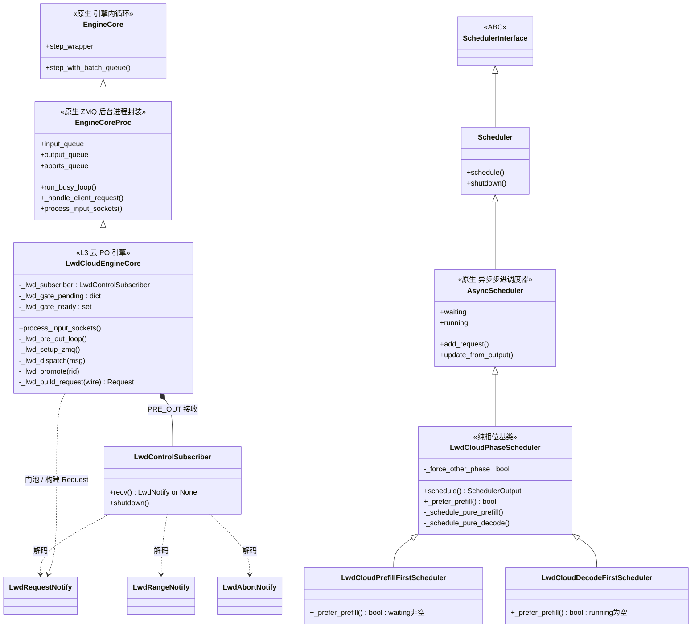
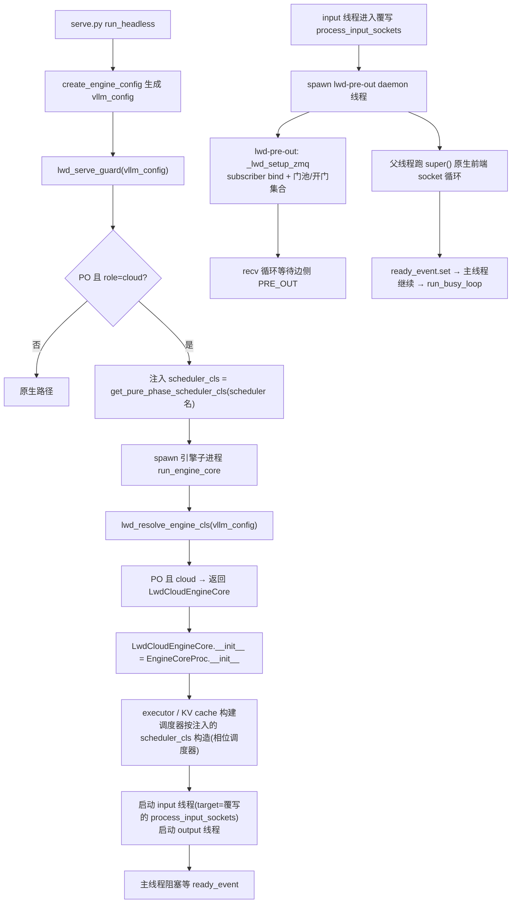
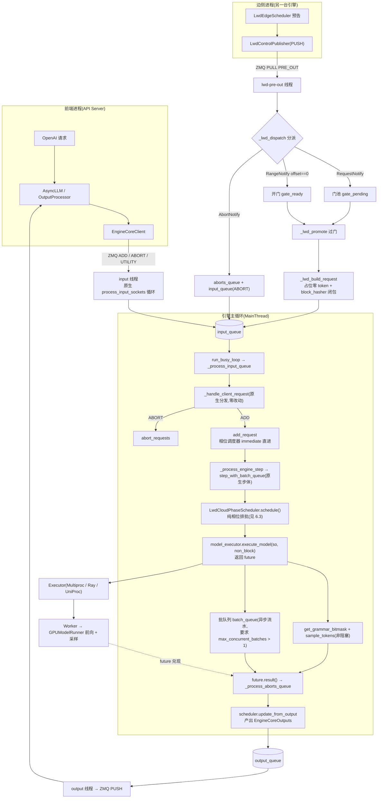
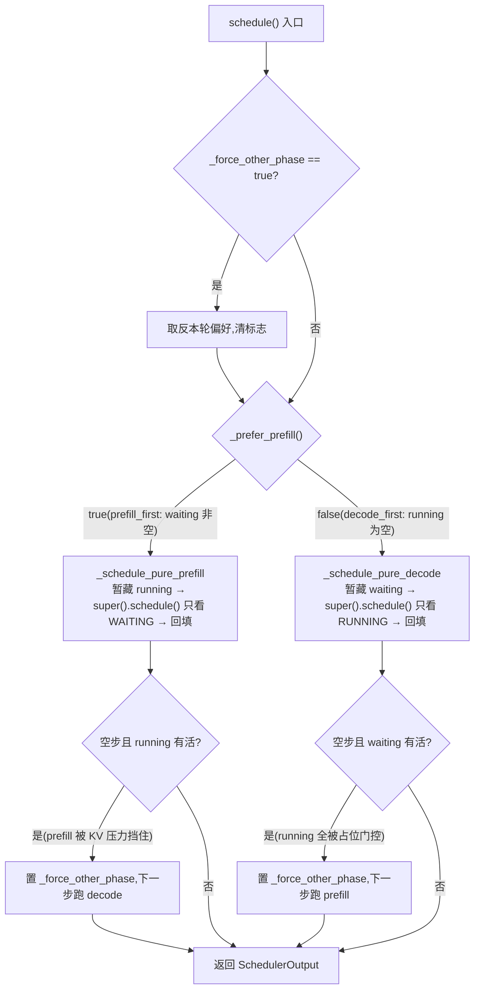

# control_cloud_scheduler 组件设计文档(云侧 PO 引擎 + 相位调度器)

> 范围:`vllm/vllm/v1/lwd_control/control_cloud_scheduler/` 包内全部组件
> (`lwd_cloud_engine.py`、`lwd_cloud_phase_scheduler.py`)
> 上游文档:`prefill_only_migration.md`(总体迁移方案,本文引用其 §9/§10 术语)、
> `lwd_control_communication_composition.md`(传输层设计,本文只消费不定义)
> 代码基线:含"PRE_OUT 循环独立线程化"改造(见 §4.1.2);行号会漂移,引用以函数名为准

---

## 1. 组件定位

云侧组件是 prefill_only 模式下**云角色进程**的形态来源,由两部分组成:

| 组件 | 职责 | 不做什么 |
|------|------|----------|
| `LwdCloudEngineCore` | 把边侧 PRE_OUT 控制消息转成原生请求管线可消费的 `Request`,注入原生 `input_queue` | 不改 step 语义(云侧零 `step_wrapper` 依赖,§10.12);不碰数据面(KV/张量接收归数据面落位) |
| `LwdCloudPhaseScheduler` 家族 | 在原生 `AsyncScheduler` 之上做**纯相位批次**(prefill 与 decode 不混批) | 不做准入控制(固定 immediate 直进,§10.14);不做暂存/释放闸 |

设计原则(承接迁移文档 §10.14):云引擎"出生即云形态"——不经装配期改写,
而是由 `run_engine_core` 的**类选择点**直接构造子类;调度器由 serve 入口守卫
在**构造期注入** `scheduler_cls`,引擎出生即带相位调度器。core.py 对云侧零改动。

```
接入点全景(仅 2 处,均 additive):
  serve.py run_headless ──> lwd_serve_guard ──> 注入 scheduler_cls(相位调度器)
  core.py run_engine_core ──> lwd_resolve_engine_cls ──> 返回 LwdCloudEngineCore
```

## 2. 组件清单

| 文件 | 符号 | 类别 | 职责 |
|------|------|------|------|
| `lwd_cloud_engine.py` | `LwdCloudEngineCore` | L3 引擎子类 | PRE_OUT 接收循环 + 首预告门 + 请求构建;覆写唯一入口 `process_input_sockets` |
| `lwd_cloud_phase_scheduler.py` | `LwdCloudPhaseScheduler` | 调度基类 | 纯相位批次策略骨架(队列手术 + 空步换相) |
| | `LwdCloudPrefillFirstScheduler` | 具体策略 | strict prefill 优先(默认):waiting 非空则每步纯 prefill |
| | `LwdCloudDecodeFirstScheduler` | 具体策略 | decode 优先(吞吐优先备选):running 非空则每步纯 decode |
| | `get_pure_phase_scheduler_cls()` | 工厂 | 相位名 → 类,未知名 warn-and-fallback 到 prefill_first |

## 3. 数据结构说明

### 3.1 消费的线上协议结构(定义在 `control_communication/lwd_notify.py`)

| 结构 | 字段 | 云侧用途 |
|------|------|----------|
| `LwdRequestNotify` | `request_id` / `num_prompt_tokens` / `max_tokens`(默认 16) / `block_hashes: list[bytes]` | 请求元数据预告。`num_prompt_tokens` 决定占位 token 长度;`max_tokens` 供云侧判定终结;`block_hashes` 是边侧本地 prompt 的全量满块链,云侧借它按**真实内容**命中前缀缓存(云侧 prompt 是占位零值,本地哈希算不出真链) |
| `LwdRangeNotify` | `request_id` / `offset` / `num_tokens` / `seqno` | 调度范围预告。`offset` = 该 chunk 起始位置(边侧调度前进度);`offset==0` 是首预告门的**开门条件**;`seqno` 单调递增,数据面落位后用于登记接收 |
| `LwdAbortNotify` | `request_id` | 终结预告:清门 + 双队列 abort |

三类消息共用 ZMQ PULL 单通道(PRE_OUT),msgspec 编解码,`Union` tag 区分。

### 3.2 引擎内部状态(`LwdCloudEngineCore`,全部归 PRE_OUT 线程独占)

| 字段 | 类型 | 用途 |
|------|------|------|
| `_lwd_subscriber` | `LwdControlSubscriber` | PRE_OUT 接收句柄(zmq PULL, bind=True);在 PRE_OUT 线程内创建与使用(zmq 单线程亲和) |
| `_lwd_gate_pending` | `dict[str, LwdRequestNotify]` | **门池**:已收到元数据、尚未开门的请求。key 为 request_id;重复元数据告警丢弃 |
| `_lwd_gate_ready` | `set[str]` | **已开门集合**:收到 `offset==0` range 即登记。支撑乱序防御——range 先到、request 后到同样放行 |

三个字段均在 `_lwd_setup_zmq()` 中初始化,而该函数在 PRE_OUT 线程内、进入
接收循环之前调用(先建后用,无构造期竞态)。

### 3.3 调度器内部状态(`LwdCloudPhaseScheduler`)

| 字段 | 类型 | 用途 |
|------|------|------|
| `_force_other_phase` | `bool` | 一次性换相标志:本轮相位产出空步且另一侧人口有活,则下一步强制走另一相位,防 KV 压力/占位门控造成的空转死锁 |

### 3.4 构建的请求对象(`_lwd_build_request` 产物)

| 要素 | 值 | 理由 |
|------|----|------|
| `prompt_token_ids` | `[0] * num_prompt_tokens` | 云侧调度只看长度;真值由边侧 embeds 经数据面提供(§9.5),线上不重复传 token |
| `sampling_params` | `SamplingParams(max_tokens=wire.max_tokens)` | 仅终结判定所需;采样细节随数据面按需增补 |
| `block_hasher` | 闭包(wire 链优先)或 `None` | 启用前缀缓存时:首建(`block_hashes` 空 且 `num_output_tokens==0`)优先用 `wire.block_hashes`(校验长度 == `num_prompt_tokens // hash_block_size`);decode 续算回本地 hasher(占位链,fail-open 不影响正确性)。未启用前缀缓存则不挂 hasher,整链机制不激活 |

## 4. 接口描述

### 4.1 `LwdCloudEngineCore(EngineCoreProc)`

构造无自有覆写(父类 `__init__` 原样);全部扩展收在下列方法。

#### 4.1.1 `process_input_sockets(input_addresses, coord_input_address, identity, ready_event)` — 覆写

- **归属线程**:父类 `__init__` 启动的原生 input 线程(core.py 以 `self.process_input_sockets`
  为 target,多态命中本覆写)。
- **行为**:① spawn `lwd-pre-out` daemon 线程(PRE_OUT 循环,见 4.1.2);
  ② **原位调用** `super().process_input_sockets(...)`——父线程照跑父类原版前端的
  socket 循环(握手应答 `EngineCoreReadyResponse`、前端 ADD/ABORT/UTILITY),零改动。
- **线程拓扑**:父线程 = 前端消息生产者;`lwd-pre-out` = PRE_OUT 消息生产者;
  两个生产者共写 `input_queue`(多生产者-单消费者),主循环无感知。

#### 4.1.2 `_lwd_pre_out_loop()` — 新增

- **归属线程**:`lwd-pre-out`(自建 daemon)。
- **行为**:`self._lwd_setup_zmq()` 先建后用(subscriber + 门状态在本线程初始化,
  消除构造期竞态,socket 建用同线程);随后 `while recv(): _lwd_dispatch(msg)`。
- **异常语义**:建站失败(bind 冲突等)→ `logger.exception` + 经
  `EngineCoreRequestType.EXECUTOR_FAILED` 投 `input_queue`,主循环以 RuntimeError
  正式杀死引擎(fail-fast,不静默降级);循环中 zmq 关停(ETERM)→ `recv()` 返回
  None,线程自然退出。

#### 4.1.3 `_lwd_setup_zmq()` — 私有

创建 `LwdControlSubscriber(endpoint, bind=True)`(endpoint 来自
`LwdConfig.from_env_and_config`),初始化门池/开门集合。仅由 4.1.2 调用一次。

#### 4.1.4 `_lwd_dispatch(msg)` — 私有,PRE_OUT 三类分派

| 消息 | 行为 |
|------|------|
| `LwdRangeNotify(offset==0)` | `_lwd_gate_ready.add(rid)` + `_lwd_promote(rid)`(开门) |
| `LwdRangeNotify(offset>0)` | 当前无动作(数据面登记接缝,§9.12) |
| `LwdRequestNotify` | rid 已在门池 → 告警丢弃;否则入池 + `_lwd_promote(rid)`(先 range 后 request 同样放行) |
| `LwdAbortNotify` | 清门池/开门集合 + `aborts_queue.put` + `input_queue.put((ABORT,[rid]))`(与原生 abort 双队列同款:eager 处理 + 保持 input_queue 次序,调度器 abort 幂等) |

#### 4.1.5 `_lwd_promote(request_id)` — 私有,过门

门池 pop wire;为 None(range 先到)则 no-op;否则 `_lwd_build_request` 后
`input_queue.put((ADD, (request, 0)))`,主循环走原生 `_handle_client_request`
分发。日志 `[Lwd] cloud request %s admitted via gate`。

#### 4.1.6 `_lwd_build_request(wire) -> Request` — 私有,唯一建请求点

见 §3.4。`Request`/`SamplingParams` 仅在本文件 import(交互预算 §7 白名单)。

### 4.2 `LwdCloudPhaseScheduler(AsyncScheduler)` 家族

除 `schedule()` 外全部继承原生 `AsyncScheduler`(add_request = immediate 直进、
`update_from_output`、`finish_requests`、swap/fallback 机制)。

| 方法 | 签名 | 语义 |
|------|------|------|
| `schedule()` | `() -> SchedulerOutput` | 唯一覆写入口。取本轮相位偏好 → `_force_other_phase` 取反(一次性)→ 纯相位排批 → 空步且对侧有活则置换相标志 |
| `_prefer_prefill()` | `() -> bool`(抽象) | 子类相位策略:`PrefillFirst` = `bool(self.waiting)`;`DecodeFirst` = `not self.running` |
| `_schedule_pure_prefill()` | `() -> SchedulerOutput` | 队列手术:暂藏 `self.running` → `super().schedule()`(只看 WAITING)→ 新转 running 的请求回填到既有 running **之后**(保 decode 优先序) |
| `_schedule_pure_decode()` | `() -> SchedulerOutput` | 队列手术:暂藏 `self.waiting`(换空队列)→ `super().schedule()`(只看 RUNNING)→ 防御性回填 |
| `_is_empty(out)` | `(SchedulerOutput) -> bool` | `total_num_scheduled_tokens == 0` |

纯 prefill 的正确性依据(§9.10):边侧请求从不产生输出 token,prompt 嵌入完成
的当步即被终结,原生 RUNNING 段每步只会调度剩余 prefill,decode 分支不可达。

#### 工厂

`get_pure_phase_scheduler_cls(name: str | None) -> type`:
registry `{"prefill_first": LwdCloudPrefillFirstScheduler, "decode_first": LwdCloudDecodeFirstScheduler}`,
缺省/未知名 warn-and-fallback 到 `prefill_first`。由 `lwd_serve_guard` 在
`vllm_config.scheduler_config.scheduler_cls` 上注入(构造期解析,类对象跨进程
按模块引用序列化)。

## 5. 类图



选择点关系(非继承):`lwd_control.lwd_resolve_engine_cls` → 返回
`LwdCloudEngineCore` 类;`lwd_control.lwd_serve_guard` → `get_pure_phase_scheduler_cls`
→ 把相位调度器类写入 `scheduler_config.scheduler_cls`。

## 6. 流程图:api-server → executor 全链路(云角色)

### 6.1 启动装配



### 6.2 请求运行期(双入口汇流到原生管线)



说明:数据面(边侧 KV/嵌入张量到云侧的落位)不在本目录范围,上图前向所消费的
KV 由数据面接缝提供;云侧 prompt token 为占位零值,不参与数值计算语义。

### 6.3 相位调度决策(`LwdCloudPhaseScheduler.schedule`)



## 7. 线程模型一览(云引擎进程内)

| 线程 | 来源 | 职责 | 触达的共享状态 |
|------|------|------|----------------|
| MainThread | `run_busy_loop` | 步进、调度器触达、`_handle_client_request` 分发 | `input_queue`(消费)、`output_queue`(产)、调度器 |
| input 线程(原生) | `EngineCoreProc.__init__` | 前端 socket 循环:握手应答、ADD/ABORT/UTILITY | `input_queue`、`aborts_queue` |
| output 线程(原生) | `EngineCoreProc.__init__` | `output_queue` → ZMQ PUSH 到前端/协调器 | `output_queue` |
| `lwd-pre-out` | 覆写 `process_input_sockets` spawn | PRE_OUT 接收、首预告门、请求构建、abort 转发 | `_lwd_subscriber`、门池/开门集合(独占)、`input_queue`、`aborts_queue` |

同步机制:全部经 `queue.Queue`(线程安全)汇流,门状态单线程独占,无锁。

## 8. 约束、已知缺口与部署要点

### 8.1 部署约束

| 约束 | 说明 |
|------|------|
| `max_concurrent_batches > 1` | 异步流水线;云侧 `step()` 同步路径兼容但慢(与边侧不同,边侧 =1 会静默失效) |
| 仅 `run_headless` 注入相位调度器 | 非 headless serve 下引擎类仍被选中但 `scheduler_cls` 不注入 → 云引擎 + 原生 AsyncScheduler 混搭;内嵌 `LLM()` 模式两挂点均不经过 |
| MoE + DP 分支 | `run_engine_core` 的 MoE DP 分支走 `DPEngineCoreProc`,云引擎不被选中 |
| 配置 | `additional_config.edge_cloud_config`:云角色需 `mode=prefill_only`、`role=cloud`,可选 `scheduler`(prefill_first/decode_first)、`pre_out_host/port`;env `VLLM_ASCEND_LWD_PRE_OUT_HOST/PORT/DEBUG` 只覆盖地址与调试 |

### 8.2 已知缺口(控制面已建、待数据面/接线收敛)

| # | 缺口 | 影响 | 计划归属 |
|---|------|------|----------|
| G1 | 边侧 `lwd_edge_notify_request` / `lwd_edge_abort` 出口无调用方 | 云侧当前实际收不到任何请求/abort,门池恒空 | 数据面落位(§9.12)接线 |
| G2 | 首预告门 `offset==0` 判据与边侧前缀缓存命中冲突 | 接线后,边侧命中前缀的请求首个 range offset>0,永不开门,请求静默丢失(v1 默认开前缀缓存) | 接线前置修复:判据改为"该请求首张 range"(first_chunk 标志或最小 seqno),前缀空洞由 block_hashes 在云侧补 |
| G3 | zombie 兜底未实现 | `zombie_log_interval_s` 为死配置;门池卡死无检测 | 数据面落位 |
| G4 | `_lwd_subscriber` 无关停路径 | 引擎关停不收 PRE_OUT 通道,靠进程退出兜底 | 云侧关停收敛 |
| G5 | `offset>0` 的 range 无任何登记/日志 | 数据面接缝就位前,非首 chunk 预告被静默忽略 | 数据面落位 |
