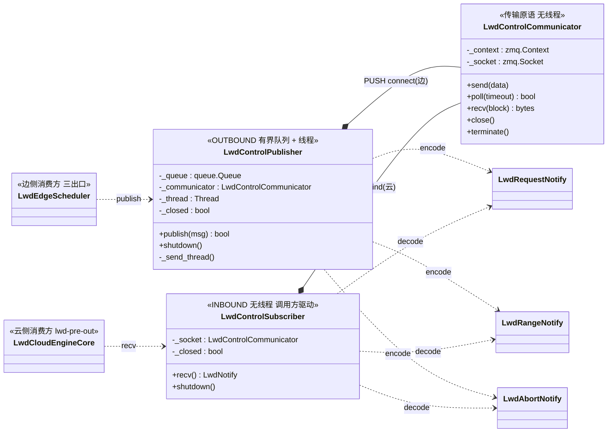
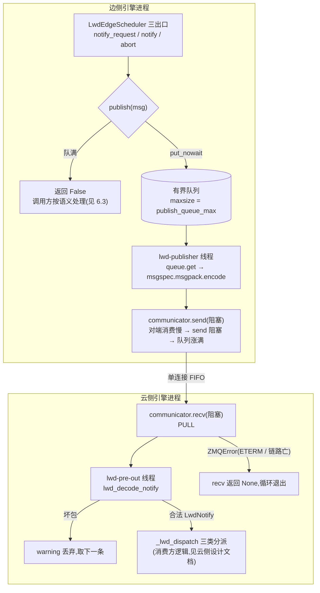
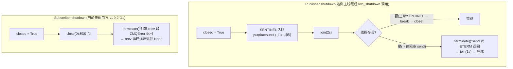

# control_communication 组件设计文档(控制面传输层 + 线上协议)

> 范围:`vllm/vllm/v1/lwd_control/control_communication/` 包内全部组件
> (`lwd_notify.py`、`lwd_control_communicator.py`、`lwd_control_publisher.py`、
> `lwd_control_subscriber.py`)
> 上游文档:`prefill_only_migration.md`(总体迁移方案,本文引用其 §2/§9 术语)、
> `lwd_control_communication_composition.md`(组合化重构方案,本文描述其落地后形态)、
> `lwd_cloud_scheduler_design.md`(云侧消费方)
> 代码基线:组合化重构 + §10.14 无线程化收发改造之后——subscriber 已从
> "自有线程 + drain"改为**调用方驱动的阻塞 recv**(composition 文档 §3/§5 的
> subscriber 行已过时,以本文为准);行号会漂移,引用以函数名为准

---

## 1. 组件定位

控制通信包是边→云单向控制面(§9.1)的**传输层 + 线上协议**,side-agnostic:
不知道自己是边是云,bind/connect 由装配期 wiring 决定;不知道消息的业务含义,
只认协议结构与字节。由四部分组成:

| 组件 | 职责 | 不做什么 |
|------|------|----------|
| `lwd_notify.py`(协议) | 定义 PRE_OUT 三类通知结构 + msgspec 编解码唯一入口 | 不解释字段语义;不携带 tensor(§2.7 控制面专用) |
| `LwdControlCommunicator`(收发器) | ZMQ socket 句柄:send/recv/close/terminate,无线程 | 无队列无线程,无重连/重发;socket 单线程亲和 |
| `LwdControlPublisher`(发布端) | 有界队列 + 后台线程,把通知编码后 PUSH 发出;队满返回 False 形成背压 | 不重试不缓存溢出消息(重试策略归调用方);不知道对端是谁 |
| `LwdControlSubscriber`(订阅端) | 阻塞 recv 一条解码一条返回;坏包丢弃取下一条 | 无线程(节奏由调用方线程驱动);不分派(分派归云引擎) |

设计原则:

1. **句柄与机制分离**:communicator 只做 socket 原语,线程生命周期归
   publisher/subscriber 各自编排(组合化重构 P1/P2 的落地形态);
2. **有界背压,不静默丢**:PUSH 阻塞 send 传导对端压力 → 内部队列涨满 →
   `publish` 返回 False,是否重试/放弃/本步不派发由调用方按消息语义决定(§2.4);
3. **fail-open 解码**:坏包丢弃 + warning,不中断接收(坏包现实来源仅对端
   版本漂移,同进程编码自身不会产生);
4. **msgspec 替代源仓 pickle**:帧即 msgpack 全帧(无独立帧头/序号字段),
   Union tag 区分类型,消除 pickle RCE 面。

```
接入点全景(2 个消费方,各 1 实例):
  边侧  lwd_edge_assemble._lwd_edge_build_planes ──> LwdControlPublisher(endpoint, bind=False, connect)
        调用方:LwdEdgeScheduler 三出口(notify_request / notify / abort)
  云侧  LwdCloudEngineCore._lwd_setup_zmq ──> LwdControlSubscriber(endpoint, bind=True)
        调用方:lwd-pre-out 线程 recv 循环 → _lwd_dispatch
```

## 2. 组件清单

| 文件 | 符号 | 类别 | 职责 |
|------|------|------|------|
| `lwd_notify.py` | `LwdRequestNotify` / `LwdRangeNotify` / `LwdAbortNotify` | msgspec Struct | 线上协议三结构(字段见 §3.1) |
| | `LwdNotify` / `lwd_encode_notify` / `lwd_decode_notify` | Union + 编解码 | 解码器唯一入口;坏包抛 DecodeError/ValidationError |
| `lwd_control_communicator.py` | `LwdControlCommunicator` | 传输原语 | socket 句柄,无线程,单线程亲和 |
| `lwd_control_publisher.py` | `LwdControlPublisher` | OUTBOUND | 有界队列 + `lwd-publisher` 线程;`publish`/`shutdown` |
| `lwd_control_subscriber.py` | `LwdControlSubscriber` | INBOUND | 阻塞 recv + 解码;`recv`/`shutdown`,无线程 |

## 3. 数据结构说明

### 3.1 线上协议结构(`lwd_notify.py`,均为 `msgspec.Struct, gc=False, tag=True`)

| 结构 | 字段(默认) | 语义 |
|------|------|------|
| `LwdRequestNotify` | `request_id` / `num_prompt_tokens` / `max_tokens`(=16) / `block_hashes: list[bytes]`(=[]) | 请求登记:长度决定云侧占位 token 数;`max_tokens` 供云侧判终结;`block_hashes` 是边侧 prompt 全量满块链,云侧借它按真实内容命中前缀缓存(§10.13) |
| `LwdRangeNotify` | `request_id` / `offset` / `num_tokens` / `seqno` | 范围排期:chunk 起点/长度;`offset==0` 是云侧首预告门判据;`seqno` 全局单调(数据面登记/HCCL 配对的事实源,当前云侧无消费点) |
| `LwdAbortNotify` | `request_id` | 终结:云侧清门 + 双队列原生 ABORT |

三结构经 `LwdNotify = Union[...]`(typing.Union,非 PEP 604——msgspec 解码器
全版本支持路径)+ `tag=True` 实现同通道复用:每帧一个 msgpack 文档,tag 字段
区分类型。协议模块另在 `TYPE_CHECKING` 下 re-export `EngineCoreOutputs`
(step 载体返回注解共用;其余内核文件不得直连 `vllm.v1.engine`,白名单 §7.2)。

### 3.2 编解码器

`_NOTIFY_DECODER = msgspec.msgpack.Decoder(LwdNotify)` 为模块级单例;
`lwd_encode_notify` / `lwd_decode_notify` 是编码/解码唯一入口。解码失败抛
`msgspec.DecodeError / ValidationError`,由订阅端捕获。

### 3.3 `LwdControlCommunicator` 内部状态

| 字段 | 类型 | 用途 |
|------|------|------|
| `_context` | `zmq.Context` | 每实例独立 context;`terminate()` 即 term 它 |
| `_socket` | `zmq.Socket` | `LINGER=2000`(退出不因未发帧挂死,显式 close(0) 可覆盖);bind/connect 由 `bind` 参数定 |

### 3.4 `LwdControlPublisher` 内部状态

| 字段 | 类型 | 用途 |
|------|------|------|
| `_queue` | `queue.Queue(maxsize=queue_max)` | 有界队列(默认 `LWD_PUBLISH_QUEUE_MAX=1000`);ZMQ 编码/发送成本不落调用方线程 |
| `_communicator` | `LwdControlCommunicator(PUSH)` | 发送句柄;由 `_send_thread` 线程独占 |
| `_thread` | `Thread("lwd-publisher", daemon)` | 全部自有状态就绪后**最后启动**(结构性消除倒置构造,composition P1) |
| `_closed` | `bool` | shutdown 幂等标志;关停令 `_LWD_PUBLISH_SHUTDOWN = None` 入队(None 不会与通知混淆) |

### 3.5 `LwdControlSubscriber` 内部状态

| 字段 | 类型 | 用途 |
|------|------|------|
| `_socket` | `LwdControlCommunicator(PULL)` | 接收句柄;由调用方线程(lwd-pre-out)创建与使用(zmq 单线程亲和,先建后用) |
| `_closed` | `bool` | shutdown 幂等标志;recv 循环每轮检查 |

## 4. 接口描述

### 4.1 `LwdControlCommunicator`

| 方法 | 签名 | 语义 |
|------|------|------|
| `__init__` | `(endpoint, socket_type, *, bind)` | 建 context + socket,`LINGER=2000`,bind 或 connect |
| `send` | `(data: bytes) -> None` | 阻塞发送;无对端时阻塞,背压由调用方有界队列承接。仅持有线程可调 |
| `poll` | `(timeout: int) -> bool` | 等 socket 可读(毫秒)。**当前两侧均为阻塞驱动,本原语未被使用**,为轮询型持有方预留 |
| `recv` | `(block: bool = True) -> bytes` | 阻塞接收;`block=False` 时无消息抛 `zmq.Again`。仅持有线程可调 |
| `close` | `() -> None` | `close(0)` 立即返回并丢弃未发帧;pyzmq 重复 close 安全;**不保证唤醒**其他线程阻塞中的 recv(平台相关,composition P5 实测结论) |
| `terminate` | `() -> None` | term context:使阻塞中的 send/recv 以 `ETERM` 返回并阻塞至收尾。**跨线程打断阻塞收发的唯一可靠手段** |

### 4.2 `LwdControlPublisher`

| 方法 | 签名 | 语义 |
|------|------|------|
| `__init__` | `(endpoint, *, bind, queue_max=1000)` | 建队列 + PUSH communicator + 线程;线程最后启动 |
| `publish` | `(msg: LwdNotify) -> bool` | `put_nowait` 入队;**队满返回 False**(可预期失败,不抛异常、不影响已发消息)。重试/放弃策略归调用方 |
| `shutdown` | `() -> None` | 幂等。关停令 `put(timeout=1.0)`(Full 抑制——线程卡死时随进程退出)→ `join(2s)` → 仍存活(卡在阻塞 send)则 `terminate()` 兜底再 `join(1s)` |
| `_send_thread` | 内部 | `queue.get()` → 关停令则退出 → `lwd_encode_notify` → `communicator.send`;退出时 `close(0)` |

### 4.3 `LwdControlSubscriber`

| 方法 | 签名 | 语义 |
|------|------|------|
| `__init__` | `(endpoint, *, bind)` | 建 PULL communicator;在调用方线程内创建(zmq 亲和) |
| `recv` | `() -> LwdNotify \| None` | 循环:阻塞 recv → 解码返回;坏包 warning 丢弃取下一条;`zmq.ZMQError`(含 ETERM 关停)返回 None 结束循环。无线程,等待节奏由调用方定 |
| `shutdown` | `() -> None` | 幂等。`close(0)` 释放 fd → `terminate()` 使阻塞 recv 以 ZMQError 返回(P5 修正:term 才是可靠打断,close 不保证唤醒) |

### 4.4 协议编解码(`lwd_notify.py`)

| 函数 | 签名 | 语义 |
|------|------|------|
| `lwd_encode_notify` | `(LwdNotify) -> bytes` | msgpack 编码,发布端唯一入口 |
| `lwd_decode_notify` | `(bytes) -> LwdNotify` | 按 Union tag 解码,订阅端唯一入口;坏包抛异常由接收线程捕获丢弃 |

## 5. 类图



说明:三结构非继承关系,靠 msgspec `tag=True` 在 `LwdNotify` Union 内区分;
同端点上一条 PUSH(边 connect)对一条 PULL(云 bind),单连接单生产者单消费者。

## 6. 流程图

### 6.1 端到端发送/接收路径



### 6.2 关停路径(双侧幂等)



### 6.3 失败路径与出口策略(队满时,重试策略归调用方)

| 调用方 / 消息 | publish False 后的行为 | 失败后果 |
|------|------|------|
| `lwd_edge_notify_request` / RequestNotify | 短退避重试 3 次(0.1/0.2/0.3s),超限丢弃 + warning | add 语义不可挡本地调度;云侧失步靠 zombie 检测兜底(§8.3-2,检测本身未实现) |
| `lwd_edge_notify` / RangeNotify | 返回 False → **本步不派发执行**,下一步原生调度复现同一范围重试 | 无损失(预告与数据原子绑定;重复预告云侧按 (request_id, offset) 幂等) |
| `lwd_edge_abort` / AbortNotify | 尽力而为,丢则 warning | 云侧自身 finish / zombie 兜底 |

坏包路径:仅对端版本漂移可达(同进程编码不会自产坏包),丢弃 + warning,
不影响后续消息。

## 7. 线程模型一览

边侧引擎进程:

| 线程 | 来源 | 职责 | 触达的共享状态 |
|------|------|------|----------------|
| 主循环线程 | EngineCore | 三出口调用 `publish`(仅 `put_nowait`) | `_queue`(生产端) |
| `lwd-publisher`(daemon) | `Publisher.__init__` 最后启动 | `get` → 编码 → `send` | `_queue`(消费端)、communicator(独占) |

云侧引擎进程:

| 线程 | 来源 | 职责 | 触达的共享状态 |
|------|------|------|----------------|
| `lwd-pre-out`(daemon) | `LwdCloudEngineCore.process_input_sockets` spawn | subscriber 先建后用;`recv` 循环 + 解码 + 三类分派 | subscriber/communicator(独占)、门状态(独占)、`input_queue` / `aborts_queue`(多生产者-单消费者) |

同步机制:跨线程汇流全部经 `queue.Queue`;communicator 单线程亲和——
`send`/`recv` 仅持有线程可调,`close`/`terminate` 是仅有的合法跨线程调用
(且仅限关停路径);无锁。

## 8. 顺序与可靠性语义

**顺序:端到端 FIFO,可以依赖。**保证链五跳:① 边侧单生产者(三出口同在
EngineCore 主循环线程)→ ② `queue.Queue` FIFO → ③ 单发送线程按出队序发送 →
④ ZMQ PUSH/PULL 单连接保序 → ⑤ 云侧单接收线程顺序分派。DP 多 rank 各自
publisher 到同一端点时跨 rank 交错,但同一请求的消息同源同 rank,请求内有序
不变。组合化冒烟(203 条消息 FIFO 保序、双侧关停毫秒级幂等)为佐证。

**丢失面(两处,均调用方可见或可观测):**

| 丢失点 | 机制 | 可见性 |
|------|------|--------|
| 发布队列溢出 | `publish` 返回 False,消息不入队 | 调用方返回值;出口策略见 6.3 |
| 坏包 | 解码失败丢弃 | warning 日志 |

**不提供的**:无 ack/心跳(链路死活不感知,发端无感知地丢、收端无超时地等);
无应用层重发;无帧级序号(源仓 8B seq 帧头已废,序号仅存在于 RangeNotify
载荷内)。传输层断线由 zmq 底层自动重连,重连后的消息连续性不保证。

## 9. 约束、已知缺口与部署要点

### 9.1 部署约束

| 约束 | 说明 |
|------|------|
| 端点单通道双角色 | 边 connect(`bind=False`)、云 bind(`bind=True`),端点同源 `LwdConfig.lwd_pre_out_endpoint()`;env `VLLM_ASCEND_LWD_PRE_OUT_HOST/PORT` 覆盖 |
| `queue_max` 可配 | 装配期经 `config.publish_queue_max` 注入(缺省 1000);调小加剧队满丢弃,调大加剧积压滞后 |
| `LINGER=2000` | 进程退出不因未发帧挂死;需要立即丢弃语义时显式 `close(0)` |
| 一 publisher 对一 subscriber | 无多路复用;断线由 zmq 自动重连,应用层无重发 |

### 9.2 已知缺口与注意项

| # | 项 | 说明 | 归属 |
|---|------|------|------|
| G1 | 云侧 subscriber 无关停调用方 | `LwdCloudEngineCore` 不调 `subscriber.shutdown()`:引擎关停不收 PRE_OUT 通道,`close/terminate/LINGER` 全不触发,靠进程退出兜底 | 云侧关停收敛(云侧设计文档 G4 同源) |
| G2 | `recv` 的 ZMQError 不分级 | ETERM(正常关停)与其他 ZMQ 错误同路径静默退出循环,无日志区分 | 传输层小改 |
| G3 | 无心跳 / ack / 帧头序号 | 链路死活与静默丢包均不感知;`seqno` 当前无云侧消费点 | 数据面落位(§9.12)一并收敛 |
| G4 | 坏包路径缺回归保护 | 组合化方案的冒烟(203 条保序 + 关停幂等)未固化为仓内测试,关停语义存在回退风险(composition §6 后续建议) | 测试补齐 |
| G5 | 队满丢弃无计数器 | 丢弃可见性只在调用方 warning,传输层无统计;观测面归 lwd_diagnostics(未落) | 观测面 |
