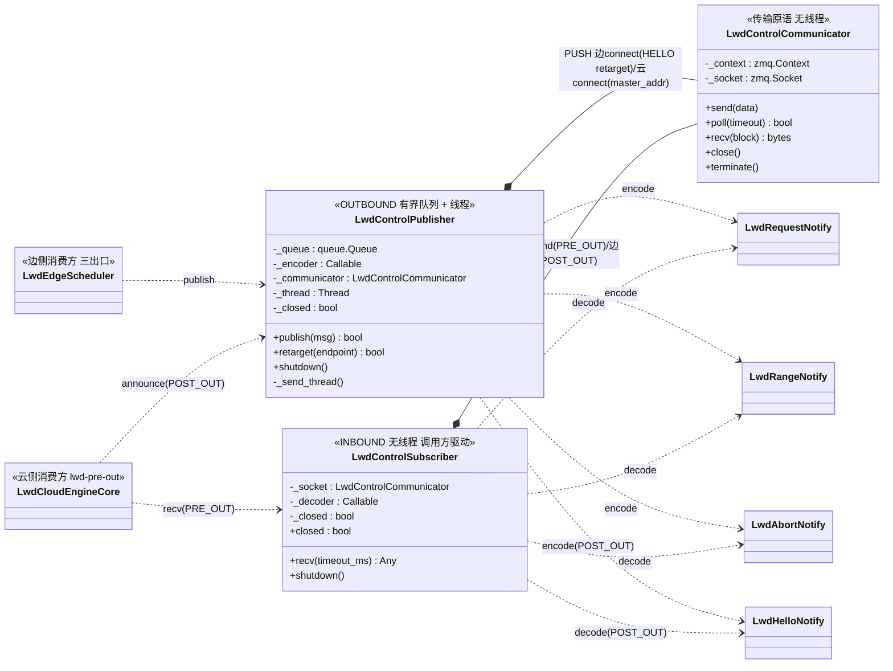
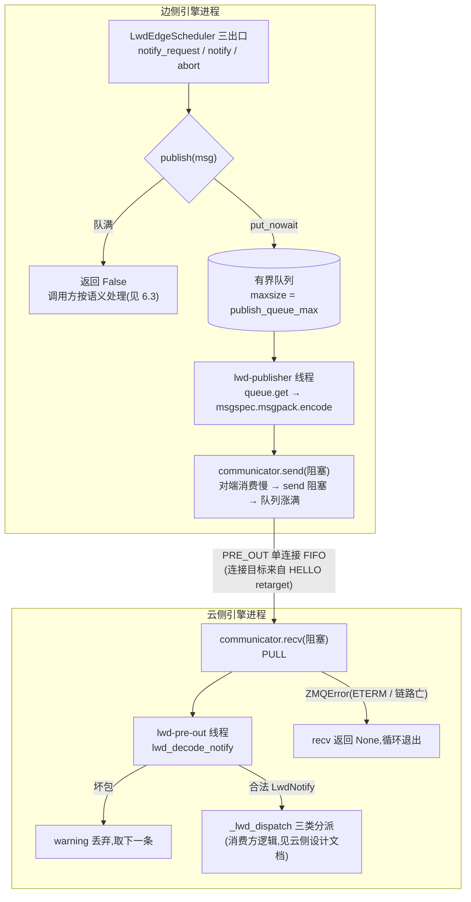
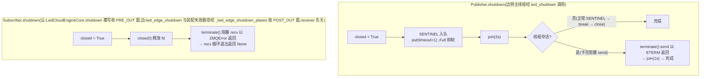
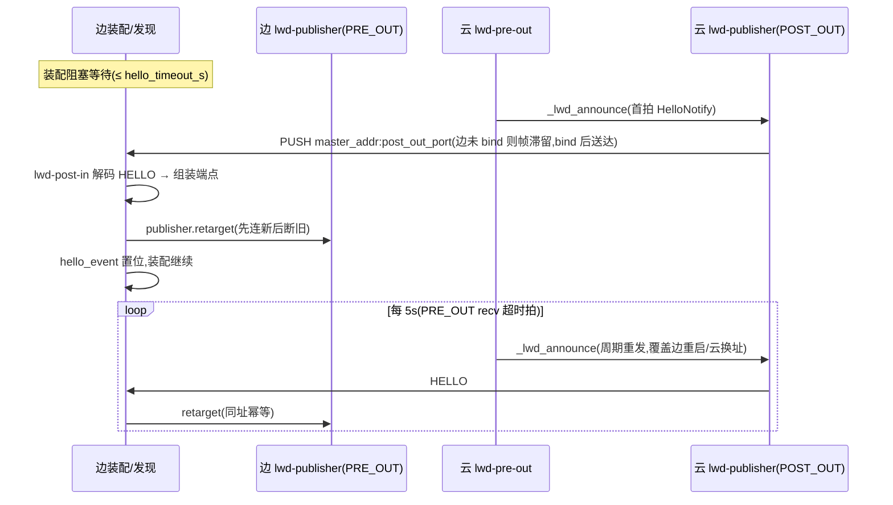
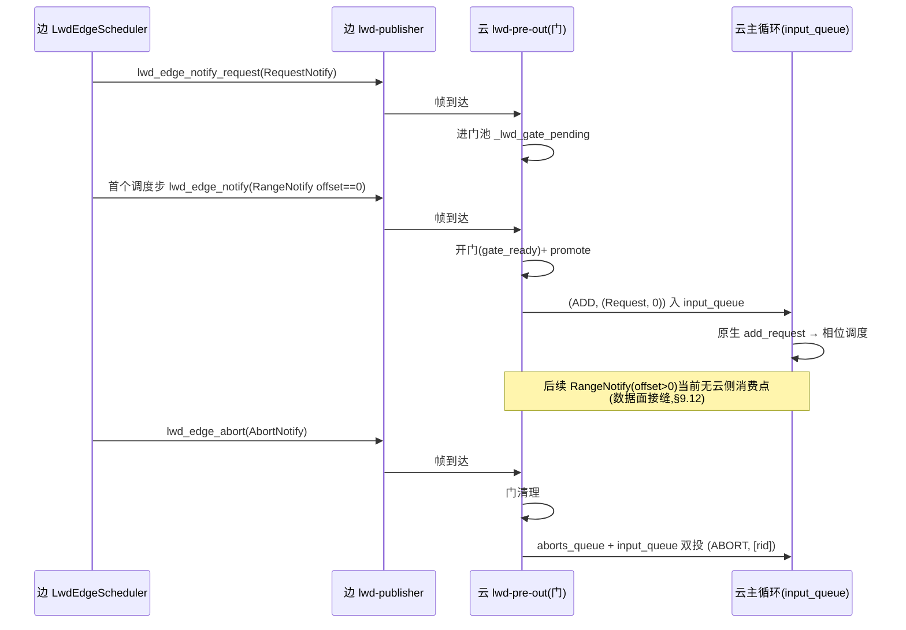

# control_communication 组件设计文档(控制面传输层 + 线上协议)

> 范围:`vllm/vllm/v1/lwd_control/control_communication/` 包内全部组件
> (`lwd_notify.py`、`lwd_control_communicator.py`、`lwd_control_publisher.py`、
> `lwd_control_subscriber.py`)
> 上游文档:`prefill_only_migration.md`(总体迁移方案,本文引用其 §2/§9 术语)、
> `lwd_control_communication_composition.md`(组合化重构方案,本文描述其落地后形态)、
> `lwd_cloud_scheduler_design.md`(云侧消费方)
> 代码基线:双面拓扑 + HELLO 发现协议之后——相对 composition 文档:
> subscriber 已从"自有线程 + drain"改为**调用方驱动的阻塞 recv**(带
> `timeout_ms` 超时拍);新增 POST_OUT 面、encoder/decoder 构造注入与
> `retarget` 延迟连接;行号会漂移,引用以函数名为准

---

## 1. 组件定位

控制通信包是边→云单向控制面(§9.1)的**传输层 + 线上协议**,side-agnostic:
不知道自己是边是云,bind/connect 由装配期 wiring 决定;不知道消息的业务含义,
只认协议结构与字节。由四部分组成:

| 组件 | 职责 | 不做什么 |
|------|------|----------|
| `lwd_notify.py`(协议) | 定义 PRE_OUT 三类通知结构 + msgspec 编解码唯一入口 | 不解释字段语义;不携带 tensor(§2.7 控制面专用) |
| `LwdControlCommunicator`(收发器) | ZMQ socket 句柄:send/recv/close/terminate,无线程 | 无队列无线程,无重连/重发;socket 单线程亲和 |
| `LwdControlPublisher`(发布端) | 有界队列 + 后台线程,把通知编码后 PUSH 发出;队满返回 False 形成背压 | 不重试不缓存溢出消息(重试策略归调用方);不知道对端是谁 |
| `LwdControlSubscriber`(订阅端) | 阻塞 recv 一条解码一条返回;坏包丢弃取下一条 | 无线程(节奏由调用方线程驱动);不分派(分派归云引擎) |

设计原则:

1. **句柄与机制分离**:communicator 只做 socket 原语,线程生命周期归
   publisher/subscriber 各自编排(组合化重构 P1/P2 的落地形态);
2. **有界背压,不静默丢**:PUSH 阻塞 send 传导对端压力 → 内部队列涨满 →
   `publish` 返回 False,是否重试/放弃/本步不派发由调用方按消息语义决定(§2.4);
3. **fail-open 解码**:坏包丢弃 + warning,不中断接收(坏包现实来源仅对端
   版本漂移,同进程编码自身不会产生);
4. **msgspec 替代源仓 pickle**:帧即 msgpack 全帧(无独立帧头/序号字段),
   Union tag 区分类型,消除 pickle RCE 面。

```
接入点全景(双面拓扑,4 个实例):

  PRE_OUT(边 -> 云,数据传输面):
    边  lwd_edge_assemble:LwdControlPublisher(endpoint=None 延迟连接,
        目标自 HELLO 通告 retarget;bind=False)
        调用方:LwdEdgeScheduler 三出口(notify_request / notify / abort)
    云  LwdCloudEngineCore._lwd_setup_zmq:LwdControlSubscriber(bind=True)
        调用方:lwd-pre-out 线程 recv 循环 → _lwd_dispatch

  POST_OUT(云 -> 边,发现/保留面,当前仅 HELLO 通告):
    云  LwdCloudEngineCore._lwd_setup_zmq:LwdControlPublisher(connect
        tcp://{master_addr}:{post_out_port},encoder=lwd_encode_cloud_notify)
        调用方:_lwd_announce(启动首拍 + PRE_OUT recv 超时拍周期重发)
    边  lwd_edge_assemble._lwd_edge_build_post_out:LwdControlSubscriber
        (bind tcp://*:{post_out_port},decoder=lwd_decode_cloud_notify)
        调用方:lwd-post-in 发现线程 recv 循环 → publisher.retarget
```

## 2. 组件清单

| 文件 | 符号 | 类别 | 职责 |
|------|------|------|------|
| `lwd_notify.py` | `LwdRequestNotify` / `LwdRangeNotify` / `LwdAbortNotify` / `LwdHelloNotify` | msgspec Struct | 线上协议四结构(字段见 §3.1) |
| | `LwdNotify` / `LwdCloudNotify` + `lwd_encode_notify` / `lwd_decode_notify` / `lwd_encode_cloud_notify` / `lwd_decode_cloud_notify` | 双面 Union + 编解码 | 按 PRE_OUT/POST_OUT 分面;坏包抛 DecodeError/ValidationError |
| `lwd_control_communicator.py` | `LwdControlCommunicator` | 传输原语 | socket 句柄,无线程,单线程亲和 |
| `lwd_control_publisher.py` | `LwdControlPublisher` | OUTBOUND | 有界队列 + `lwd-publisher` 线程;`publish`/`shutdown` |
| `lwd_control_subscriber.py` | `LwdControlSubscriber` | INBOUND | 阻塞 recv + 解码;`recv`/`shutdown`,无线程 |

## 3. 数据结构说明

### 3.1 线上协议结构(`lwd_notify.py`,均为 `msgspec.Struct, gc=False, tag=True`)

| 结构 | 字段(默认) | 语义 |
|------|------|------|
| `LwdRequestNotify` | `request_id` / `num_prompt_tokens` / `max_tokens`(=16) / `block_hashes: list[bytes]`(=[]) | 请求登记:长度决定云侧占位 token 数;`max_tokens` 供云侧判终结;`block_hashes` 是边侧 prompt 全量满块链,云侧借它按真实内容命中前缀缓存(§10.13) |
| `LwdRangeNotify` | `request_id` / `offset` / `num_tokens` / `seqno` | 范围排期:chunk 起点/长度;`offset==0` 是云侧首预告门判据;`seqno` 全局单调(数据面登记/HCCL 配对的事实源,当前云侧无消费点) |
| `LwdAbortNotify` | `request_id` | 终结:云侧清门 + 双队列原生 ABORT |
| `LwdHelloNotify` | `pre_out_host` / `pre_out_port` | 云->边发现通告(POST_OUT 周期帧):`pre_out_*` 是边侧 PRE_OUT 连接目标的**唯一事实源**(决策 B:边不读配置里的 host 做连接);`pre_out_host` 必须可路由(0.0.0.0 被 serve 守卫拦截,127.0.0.1 + 远端 master_addr 告警) |

协议**分面**:边->云方向 `LwdNotify = Union[Range/Request/Abort]`(PRE_OUT),
云->边方向 `LwdCloudNotify = Union[Hello]`(POST_OUT,结果回传/重同步在此
additive 扩展)。两侧 Union 均为 typing.Union(非 PEP 604——msgspec 解码器
全版本支持路径)+ `tag=True` 同通道复用:每帧一个 msgpack 文档,tag 字段
区分类型。协议模块另在 `TYPE_CHECKING` 下 re-export `EngineCoreOutputs`
(step 载体返回注解共用;其余内核文件不得直连 `vllm.v1.engine`,白名单 §7.2)。

### 3.2 编解码器

`_NOTIFY_DECODER = msgspec.msgpack.Decoder(LwdNotify)` 为模块级单例;
`lwd_encode_notify` / `lwd_decode_notify` 是编码/解码唯一入口。解码失败抛
`msgspec.DecodeError / ValidationError`,由订阅端捕获。

### 3.3 `LwdControlCommunicator` 内部状态

| 字段 | 类型 | 用途 |
|------|------|------|
| `_context` | `zmq.Context` | 每实例独立 context;`terminate()` 即 term 它 |
| `_socket` | `zmq.Socket` | `LINGER=2000`(退出不因未发帧挂死,显式 close(0) 可覆盖);bind/connect 由 `bind` 参数定 |
| `_endpoint` | `str \| None` | 当前连接/bind 目标;`endpoint=None` 构造**延迟连接态**(边侧 PRE_OUT:目标待 HELLO 通告,连的是通配地址不可预知) |

`retarget(endpoint)` 换连接目标(**仅持有线程调用**):先 connect 新端点再
disconnect 旧端点——zmq connect 惰性且可多管道并存,先连新保证换址期后续
消息有路可走;同址重复调用幂等(首条 HELLO 与周期重发都到时只连一次)。

### 3.4 `LwdControlPublisher` 内部状态

| 字段 | 类型 | 用途 |
|------|------|------|
| `_queue` | `queue.Queue(maxsize=queue_max)` | 有界队列(默认 `LWD_PUBLISH_QUEUE_MAX=1000`);ZMQ 编码/发送成本不落调用方线程。**同时承载两类队列元素**:待发通知 + `_LwdRetarget` 换目标命令 + 关停令 `None`,FIFO 逐个处理 |
| `_encoder` | `Callable` | 编码器注入(§10.7 协议分面):PRE_OUT 面 `lwd_encode_notify`,POST_OUT 面 `lwd_encode_cloud_notify` |
| `_communicator` | `LwdControlCommunicator(PUSH)` | 发送句柄;由 `_send_thread` 线程独占(含 `retarget` 执行权——socket 操作只在持有线程做) |
| `_thread` | `Thread("lwd-publisher", daemon)` | 全部自有状态就绪后**最后启动**(结构性消除倒置构造,composition P1) |
| `_closed` | `bool` | shutdown 幂等标志;关停令 `_LWD_PUBLISH_SHUTDOWN = None` 入队(None 不会与通知/命令混淆) |

### 3.5 `LwdControlSubscriber` 内部状态

| 字段 | 类型 | 用途 |
|------|------|------|
| `_socket` | `LwdControlCommunicator(PULL)` | 接收句柄;由调用方线程创建与使用(zmq 亲和,先建后用):PRE_OUT 面 = lwd-pre-out,POST_OUT 面 = lwd-post-in |
| `_decoder` | `Callable` | 解码器注入(协议分面):PRE_OUT 面 `lwd_decode_notify`,POST_OUT 面 `lwd_decode_cloud_notify` |
| `_closed` | `bool` | shutdown 幂等标志;对外只读 `closed` 属性——**用于区分 recv 超时返回(None)与关停返回(None)** |

## 4. 接口描述

### 4.1 `LwdControlCommunicator`

| 方法 | 签名 | 语义 |
|------|------|------|
| `__init__` | `(endpoint: str \| None, socket_type, *, bind)` | 建 context + socket,`LINGER=2000`;`endpoint=None` 为延迟连接态(仅 connect 方可用,bind 方必须给地址) |
| `retarget` | `(endpoint: str) -> None` | 换连接目标:**仅持有线程调用**;先 connect 新再 disconnect 旧(换址期消息有路可走),同址幂等 |
| `send` | `(data: bytes) -> None` | 阻塞发送;无对端时阻塞,背压由调用方有界队列承接。仅持有线程可调 |
| `poll` | `(timeout: int) -> bool` | 等 socket 可读(毫秒)。subscriber 超时 recv(`timeout_ms`)的底座 |
| `recv` | `(block: bool = True) -> bytes` | 阻塞接收;`block=False` 时无消息抛 `zmq.Again`。仅持有线程可调 |
| `close` | `() -> None` | `close(0)` 立即返回并丢弃未发帧;pyzmq 重复 close 安全;**不保证唤醒**其他线程阻塞中的 recv(平台相关,composition P5 实测结论) |
| `terminate` | `() -> None` | term context:使阻塞中的 send/recv 以 `ETERM` 返回并阻塞至收尾。**跨线程打断阻塞收发的唯一可靠手段** |

### 4.2 `LwdControlPublisher`

| 方法 | 签名 | 语义 |
|------|------|------|
| `__init__` | `(endpoint: str \| None, *, bind, queue_max=1000, encoder=lwd_encode_notify)` | 建队列 + PUSH communicator + 线程;线程最后启动;`endpoint=None` 延迟连接(边侧 PRE_OUT) |
| `publish` | `(msg: Any) -> bool` | `put_nowait` 入队;**队满返回 False**(可预期失败,不抛异常、不影响已发消息)。重试/放弃策略归调用方 |
| `retarget` | `(endpoint: str) -> bool` | 换连接目标:**入队 `_LwdRetarget` 命令,由发送线程执行 socket 操作**(线程亲和,外部线程不触碰连接);队满丢命令返回 False,调用方保持旧目标等下条 HELLO 重试 |
| `shutdown` | `() -> None` | 幂等。关停令 `put(timeout=1.0)`(Full 抑制——线程卡死时随进程退出)→ `join(2s)` → 仍存活(卡在阻塞 send)则 `terminate()` 兜底再 `join(1s)` |
| `_send_thread` | 内部 | `queue.get()` → 关停令退出 → `_LwdRetarget` 则 `communicator.retarget` → 否则 `encoder(msg)` → `communicator.send`;退出时 `close(0)` |

### 4.3 `LwdControlSubscriber`

| 方法 | 签名 | 语义 |
|------|------|------|
| `__init__` | `(endpoint, *, bind, decoder=lwd_decode_notify)` | 建 PULL communicator;在调用方线程内创建(zmq 亲和) |
| `closed` | property | 只读;`recv` 超时返回 None 与关停返回 None 的区分位 |
| `recv` | `(timeout_ms: int \| None = None) -> Any \| None` | `timeout_ms=None`:阻塞 recv 一条解码一条;给了超时:`poll(timeout)` 超时返回 None,有帧则非阻塞收。超时/关停都返回 None(以 `closed` 区分);坏包 warning 丢弃取下一条;`zmq.ZMQError`(ETERM/Again)返回 None。无线程,等待节奏由调用方定 |
| `shutdown` | `() -> None` | 幂等。`close(0)` 释放 fd → `terminate()` 使阻塞 recv 以 ZMQError 返回(P5 修正:term 才是可靠打断,close 不保证唤醒) |

### 4.4 协议编解码(`lwd_notify.py`)

| 函数 | 签名 | 语义 |
|------|------|------|
| `lwd_encode_notify` | `(LwdNotify) -> bytes` | PRE_OUT 编码(边侧 publisher 注入) |
| `lwd_decode_notify` | `(bytes) -> LwdNotify` | PRE_OUT 解码(云侧 subscriber 注入);按 Union tag,坏包抛异常由接收线程捕获丢弃 |
| `lwd_encode_cloud_notify` | `(LwdCloudNotify) -> bytes` | POST_OUT 编码(云侧 publisher 注入) |
| `lwd_decode_cloud_notify` | `(bytes) -> LwdCloudNotify` | POST_OUT 解码(边侧 subscriber 注入) |

## 5. 类图



说明:PRE_OUT 侧三结构在 `LwdNotify` Union、POST_OUT 侧 Hello 在
`LwdCloudNotify` Union,均靠 msgspec `tag=True` 区分,非继承关系。
每个面一条 PUSH 对一条 PULL、单连接单生产者单消费者;两个面之间
无顺序约束(各自独立 FIFO)。

## 6. 流程图

### 6.1 端到端发送/接收路径



POST_OUT 面的对称路径(云 announce → 边发现 → retarget)见 §8.1 时序图。

### 6.2 关停路径(双侧幂等)



### 6.3 失败路径与出口策略(队满时,重试策略归调用方)

| 调用方 / 消息 | publish False 后的行为 | 失败后果 |
|------|------|------|
| `lwd_edge_notify_request` / RequestNotify | 短退避重试 3 次(0.1/0.2/0.3s),超限丢弃 + warning | add 语义不可挡本地调度;云侧失步靠 zombie 检测兜底(§8.3-2,检测本身未实现) |
| `lwd_edge_notify` / RangeNotify | 返回 False → **本步不派发执行**,下一步原生调度复现同一范围重试 | 无损失(预告与数据原子绑定;重复预告云侧按 (request_id, offset) 幂等) |
| `lwd_edge_abort` / AbortNotify | 尽力而为,丢则 warning | 云侧自身 finish / zombie 兜底 |
| `_lwd_announce` / HelloNotify(云 POST_OUT) | 不重试 | PRE_OUT recv 超时拍(5s)周期重发自愈;边侧发现延迟一个周期,无正确性影响 |
| `publisher.retarget` / _LwdRetarget(边) | 队满丢命令返回 False,保持旧目标 | 下条周期 HELLO(≤5s)重试;发现面周期性使命令丢失不致命 |

坏包路径:仅对端版本漂移可达(同进程编码不会自产坏包),丢弃 + warning,
不影响后续消息。

## 7. 线程模型一览

边侧引擎进程:

| 线程 | 来源 | 职责 | 触达的共享状态 |
|------|------|------|----------------|
| 主循环线程 | EngineCore | 三出口调用 `publish`(仅 `put_nowait`) | PRE_OUT `_queue`(生产端) |
| `lwd-publisher`(daemon) | `Publisher.__init__` 最后启动 | `get` → retarget 命令 / 编码 → `send`;PRE_OUT 面,连接目标待 HELLO | `_queue`(消费端)、communicator(独占,含 retarget 执行) |
| `lwd-post-in`(daemon) | `lwd_edge_try_assemble` 启动 | POST_OUT bind 先建;`recv(5s)` 循环:HELLO → `publisher.retarget`,非 HELLO 帧丢弃 | POST_OUT subscriber(独占)、PRE_OUT `_queue`(经 retarget 入队) |

云侧引擎进程:

| 线程 | 来源 | 职责 | 触达的共享状态 |
|------|------|------|----------------|
| `lwd-pre-out`(daemon) | `LwdCloudEngineCore.process_input_sockets` spawn | 双面建站( `_lwd_setup_zmq` );`recv(5s)` 循环 + 解码 + 三类分派;**超时拍重发 HELLO**(无独立定时器) | PRE_OUT subscriber/communicator(独占)、POST_OUT publisher(announce 入队)、门状态(独占)、`input_queue` / `aborts_queue`(多生产者-单消费者) |
| `lwd-publisher`(daemon) | POST_OUT `Publisher.__init__` | `get` → 编码 → `send`,向 master_addr:post_out_port 通告 | POST_OUT `_queue`(消费端)、communicator(独占) |

同步机制:跨线程汇流全部经 `queue.Queue`;communicator 单线程亲和——
`send`/`recv`/`retarget` 仅持有线程可调,`close`/`terminate` 是仅有的合法
跨线程调用(且仅限关停路径);无锁。

### 7.1 通信线程启动流程(装配期 → 首帧)

引用以函数名为准(行号会漂移,见文档头注)。双面拓扑下两侧启动互相
耦合:**边侧装配阻塞等云的 HELLO,超时 fail-fast**。

**边侧(connect 方,POST_OUT bind + PRE_OUT 延迟连接):**

```
EngineCore.__init__(尾部装配点)
  └─ lwd_try_assemble → lwd_edge_try_assemble(lwd_edge_assemble.py)
       ├─ 模式/角色判定(is_lwd_prefill_only + is_edge_node);kv_connector
       │  在位则降级原生,不装配
       ├─ _lwd_edge_build_post_out:LwdControlSubscriber(bind wildcard
       │  :post_out_port,decoder=lwd_decode_cloud_notify)
       ├─ LwdControlPublisher(endpoint=None):PRE_OUT 延迟连接态,
       │  lwd-publisher 线程最后启动(阻塞在 queue.get)
       ├─ 起发现线程 lwd-post-in(_lwd_edge_discovery_loop,daemon):
       │  循环 recv(timeout_ms=5000) → HELLO 则组装端点并
       │  publisher.retarget(见 8.1)→ 置 hello_event;
       │  非 HELLO 帧丢弃告警;周期 HELLO 常驻消费(不只首发)
       ├─ **装配线程阻塞** hello_event.wait(hello_timeout_s=30):
       │    超时 → _lwd_edge_shutdown_planes(两面自清理)+
       │    RuntimeError(fail-fast,提示查云侧 master_addr 连通性
       │    与 POST_OUT 端口)
       ├─ _lwd_edge_install_scheduler → LwdEdgeScheduler(publisher 注入)
       └─ engine_core.lwd_edge_post_out_receiver = receiver;
          engine_core.step_wrapper = LwdEdgeCore(...)
```

要点:

1. **HELLO 未到,边侧引擎起不来**:`__init__` 阻塞在装配点,原生
   input/output 线程与前端 READY 应答都被闸在其后——边侧前端就绪
   时间 = 云发现时间(≤ hello_timeout_s,否则装配失败进程退出);
2. 连接目标唯一来源是 HELLO 载荷(决策 B):边不读 `pre_out_host`
   做连接,云换址只需云侧改配置重发 HELLO;
3. scheduler 注入发生在 hello_event 置位之后,故**调度器存在时
   PRE_OUT 必已 retarget**(retarget 命令先于任何数据 publish 入队,
   发送线程按序先执行换向再发数据帧)。

**云侧(bind 方,PRE_OUT bind + POST_OUT connect 通告):**

```
run_engine_core 类选择点 → LwdCloudEngineCore(继承 EngineCoreProc.__init__)
  ├─ 前端握手 _perform_handshakes + super().__init__(引擎本体构造)
  │    (serve 守卫已先行:_lwd_cloud_deploy_guard 校验 master_addr
  │    非空、pre_out_host 非 0.0.0.0 可通告)
  ├─ input_thread = Thread(process_input_sockets) 启动(原生线程位)
  │    主线程进 ready_event.wait(10s 轮询)看门狗,仅覆盖 input 线程死亡
  └─ input_thread 实际执行的是云侧覆写的 process_input_sockets:
       ├─ 先 spawn lwd-pre-out(daemon),后调 super().process_input_sockets
       │  (原生 DEALER/coord socket 建立与 ready_event.set 在父线程路径)
       └─ lwd-pre-out 线程体 _lwd_pre_out_loop:
            ├─ _lwd_setup_zmq(双面):
            │    PRE_OUT LwdControlSubscriber(bind,先建后用,zmq 亲和)
            │    POST_OUT LwdControlPublisher(connect
            │      tcp://{master_addr}:{post_out_port})
            │    LwdHelloNotify(pre_out_host, pre_out_port)构造
            │    _lwd_announce() 首拍即通告(边可能已在 bind 等待)
            │    门状态(_lwd_gate_pending / _lwd_gate_ready)
            │  建站失败 → EXECUTOR_FAILED 入 input_queue → 主循环抛
            │  RuntimeError 升级为引擎致命错误(不静默降级)
            └─ 循环:recv(timeout_ms=5000)
                 ├─ 有帧 → _lwd_dispatch 三类分派
                 ├─ 超时(None 且未关停)→ _lwd_announce() 周期重发
                 └─ 关停(None 且 closed)→ 退出
```

要点:

1. HELLO 周期重发**挂在 PRE_OUT recv 的超时拍上**(`LWD_HELLO_RESEND_
   INTERVAL_MS=5000`),不另起定时器——通告节奏与接收循环天然串行,
   无并发时钟;
2. POST_OUT publisher 首拍 send 可能阻塞(边未 bind):只阻塞云侧
   lwd-publisher 线程,不影响 PRE_OUT 接收;边 bind 后 zmq 自动送达;
3. PRE_OUT bind 早于 `run_busy_loop` 开始:此间过门请求已可 promote
   并投 `input_queue`,消息仅积压,主循环启动后按 FIFO 消费;
4. 主线程 ready_event 看门狗只看 input 线程存活;`lwd-pre-out` 在 setup
   成功后的逐消息分派无看门狗亦无逐条兜底,线程死亡即云失聪(缺口 G6)。

**启动先后矩阵:**

| 时序 | 行为 |
|------|------|
| 云先起,边后起 | 云首拍/周期 HELLO 发出(边未 bind 时帧滞留云侧发送线程,不丢);边 bind POST_OUT → HELLO 送达 → retarget → 装配继续 |
| 边先起,云后起 | 边 bind 后阻塞等 HELLO(≤ hello_timeout_s);云起后首拍通告即送达;**云超过 hello_timeout_s 未起 → 边装配失败退出**,部署需保证云先于边 hello_timeout_s 就绪 |
| 云重启(换址或不换址) | 云启动即重新通告;边 lwd-post-in 收到 → retarget(先连新断旧,同址幂等)→ 常驻机制自愈 |
| 边重启 | 边重新 bind POST_OUT(同通配端口);云侧 PUSH 自动重连 + 周期 HELLO 重新发现,双方幂等 |

## 8. 顺序与可靠性语义

**顺序:面内端到端 FIFO,可以依赖;两平面之间无顺序约束。**单面保证链
五跳:① 单生产者(PRE_OUT:边侧三出口同在 EngineCore 主循环线程;
POST_OUT:云侧 announce 同在 lwd-pre-out 线程)→ ② `queue.Queue` FIFO →
③ 单发送线程按出队序处理(数据帧编码发送、retarget 命令执行换向)→
④ ZMQ PUSH/PULL 单连接保序 → ⑤ 单接收线程顺序分派。DP 多 rank 各自
publisher 到同一端点时跨 rank 交错,但同一请求的消息同源同 rank,请求内有序
不变。组合化冒烟(203 条消息 FIFO 保序、双侧关停毫秒级幂等)为佐证。

**丢失面(均调用方可见或可观测):**

| 丢失点 | 机制 | 可见性 |
|------|------|--------|
| 发布队列溢出 | `publish` 返回 False,消息不入队 | 调用方返回值;出口策略见 6.3 |
| retarget 命令溢出 | `retarget` 返回 False,保持旧目标 | 返回值 + error 日志;下条 HELLO 重试 |
| 坏包 | 解码失败丢弃 | warning 日志 |

**不提供的**:无 ack;**云→边方向现有周期 HELLO**(发现通告兼该方向的
存活心跳位);边→云方向仍无任何心跳,链路死活不感知(发端无感知地丢、
收端无超时地等);无应用层重发;无帧级序号(源仓 8B seq 帧头已废,序号仅
存在于 RangeNotify 载荷内)。传输层断线由 zmq 底层自动重连,重连后的消息
连续性不保证。

### 8.1 边云握手(HELLO 发现协议 + 首预告门)

双面拓扑下"握手"分两层:**发现握手**(POST_OUT 面,云→边 HELLO,解决
"边如何知道云在哪")与**请求握手**(PRE_OUT 面,首预告门,解决"云何时
可以开算一个请求")。数据传输方向(边→云)依旧无 ack 无水位,边侧除
队满背压外不依赖云侧反馈推进。

**发现握手(决策 B:HELLO 是 PRE_OUT 端点的唯一事实源):**

- 云侧 `_lwd_setup_zmq` 构造 `LwdHelloNotify(pre_out_host, pre_out_port)`,
  启动**首拍即通告**(边可能已 bind 等待),此后挂在 PRE_OUT recv 的 5s
  超时拍上周期重发——边重启后重新发现、云换址重启后驱动边 retarget;
- 边侧装配**阻塞等首条 HELLO**(`hello_event.wait(hello_timeout_s=30)`),
  超时 fail-fast;发现线程 `lwd-post-in` 常驻消费,后续每条 HELLO 都驱动
  `publisher.retarget`(同址幂等);
- HELLO 载荷的 `pre_out_host` 必须可路由:serve 守卫 `_lwd_cloud_deploy_
  guard` 启动即拦 0.0.0.0(通配 bind 地址不可通告),master_addr 缺失直接
  拒启,pre_out_host=127.0.0.1 + 远端 master_addr 告警。



**请求握手(PRE_OUT 首预告门,单连接 FIFO 保证步序):**



门的乱序防御:先 range 后 request 到达同样放行(双侧检查);重复
RequestNotify 幂等忽略——两阶段推进正是对"add 与 range 之间任意
延迟/重试"的兜底。

**换址与重连语义:**

| 场景 | 机制 | 窗口与代价 |
|------|------|-----------|
| 云换址重启 | 新云启动即通告 → 边 retarget(先 connect 新、再 disconnect 旧,旧管道滞留帧不再路由) | retarget 命令与数据帧同队 FIFO:命令之前的滞留帧仍指向旧目标,旧对端已亡时存在**队头阻塞窗口**(见 G7);周期 HELLO 保证最终收敛 |
| 边重启 | 边重 bind 同通配端口;云 PUSH 自动重连 + ≤5s 周期 HELLO 重发现 | 云侧无感知(通告幂等);边侧 retarget 同址 no-op |
| 云未起/中途亡 | 边装配 fail-fast(启动期)/ PRE_OUT send 阻塞(运行期) | 启动期 ≤ hello_timeout_s;运行期发端无感知(边→云无心跳),滞留帧占队列直至队满退避 |

关停侧握手见 6.2(云:shutdown 覆写两面收口;边:lwd_edge_shutdown /
装配失败路径 `_lwd_edge_shutdown_planes`,receiver 先关)。

## 9. 约束、已知缺口与部署要点

### 9.1 部署约束

| 约束 | 说明 |
|------|------|
| 双面四端点 | PRE_OUT(5558 缺省):云 bind `tcp://{pre_out_host}:{pre_out_port}`,边 connect 目标**只信 HELLO**(决策 B);POST_OUT(5559 缺省):边 bind `tcp://*:{post_out_port}`,云 connect `tcp://{master_addr}:{post_out_port}`。env `VLLM_ASCEND_LWD_PRE_OUT_HOST/PORT/POST_OUT_PORT/POST_OUT_BIND/HELLO_TIMEOUT_S` 覆盖 |
| 云侧必填 master_addr | POST_OUT connect 依赖;serve 守卫 `_lwd_cloud_deploy_guard` fail-fast |
| `pre_out_host` 必须可通告 | 随 HELLO 发给边作连接目标:0.0.0.0 被守卫拒绝;127.0.0.1 + 远端 master_addr 告警(边不可达) |
| 边启动闸在云发现上 | 装配阻塞 ≤ `hello_timeout_s`(缺省 30s,可配),超时 fail-fast 退出——部署须云先就绪 |
| `queue_max` 可配 | 装配期经 `config.publish_queue_max` 注入(缺省 1000);调小加剧队满丢弃,调大加剧积压滞后 |
| `LINGER=2000` | 进程退出不因未发帧挂死;需要立即丢弃语义时显式 `close(0)` |
| 每 publisher 对一 subscriber | 每面单连接单生产者单消费者,无多路复用;断线由 zmq 自动重连,应用层无重发 |

### 9.2 已知缺口与注意项

| # | 项 | 说明 | 归属 |
|---|------|------|------|
| ~~G1~~ | ~~云侧 subscriber 无关停调用方~~ | **已解决**:`LwdCloudEngineCore.shutdown` 覆写两面收口(PRE_OUT subscriber + POST_OUT publisher)后走原生;边侧 `lwd_edge_shutdown` / 装配失败路径经 `_lwd_edge_shutdown_planes` 收双面(见 6.2) | 已关闭 |
| G2 | `recv` 的 ZMQError 不分级 | ETERM(正常关停)与其他 ZMQ 错误同路径静默退出循环,无日志区分 | 传输层小改 |
| G3 | 无 ack;边→云方向无存活心跳 | 云→边已有周期 HELLO 兼心跳位;反向仍无——云侧失步(zombie)不感知,`seqno` 当前亦无云侧消费点 | 数据面落位(§9.12)一并收敛 |
| G4 | 坏包路径缺回归保护 | 组合化方案的冒烟(203 条保序 + 关停幂等)未固化为仓内测试;HELLO/retarget 路径同缺 | 测试补齐 |
| G5 | 队满丢弃无计数器 | 丢弃可见性只在调用方 warning,传输层无统计;观测面归 lwd_diagnostics(未落) | 观测面 |
| G6 | `lwd-pre-out` 线程无看门狗、分派无逐条兜底 | 主线程 ready_event 看门狗只覆盖 input 线程(见 7.1);setup 失败经 EXECUTOR_FAILED 升级,但 setup 成功后 `_lwd_dispatch`/`_lwd_build_request` 任一异常即线程静默死亡(仅 stderr traceback),云侧永久失聪无升级 | 云引擎逐消息 try/except(坏帧告警丢弃或 EXECUTOR_FAILED 升级) |
| G7 | retarget 换址的队头阻塞窗口 | retarget 命令与数据帧同队 FIFO:命令之前指向旧目标的滞留帧先发,旧对端已亡时 send 阻塞,换向被压住直至滞留帧落地/关停 term;周期 HELLO 只保证最终收敛,不保证换向即时 | 可选缓解:换址期丢弃旧目标滞留帧 / send 带超时 |
