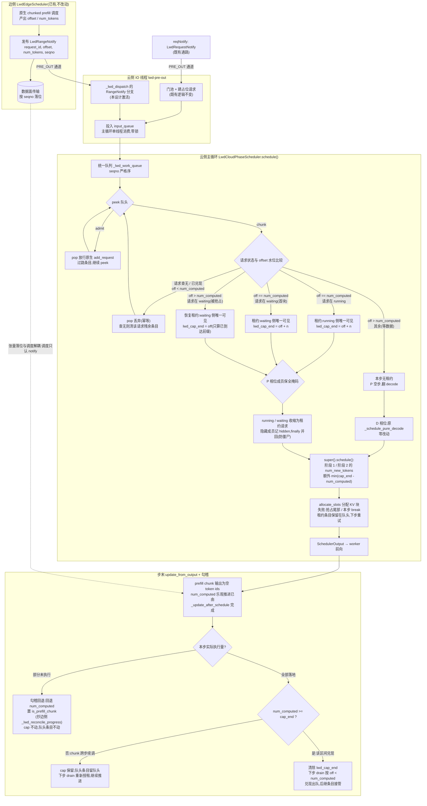
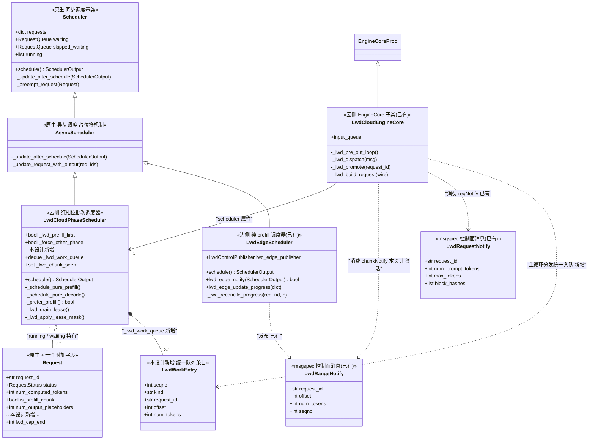

# Lwd 长序列方案设计:chunkNotify 强制调度(v3,队头租约模型)

> 状态:v3 设计稿,待实施。
> v2 → v3 变更:取消严格串行开关,**P 相位固定为"队头租约"——对 running 和
> waiting 的 prefill 工作取队头条目,仅其对应请求可见**;D 相位走原生逻辑不变
> (`_schedule_pure_decode` 已是"只让 running 的 decode 可见")。条目出队时机
> 从"生效即 pop"改为"**兑现即 pop**":队头即当前唯一 prefill 租约,在途租约靠
> 队头条目持续提供可见性。新增两条防死锁规则:waiting 请求的首块租约、
> 被抢占请求的水位恢复。原生改动由一处 `min` 增为两处(阶段 1 + 阶段 2)。
> 代码基线:`prefill_only_base_br/vllm`(含 lwd_control 边云骨架)。
> 关联文件:`vllm/v1/core/sched/scheduler.py`、`vllm/v1/core/sched/async_scheduler.py`、
> `vllm/v1/lwd_control/control_communication/lwd_notify.py`、
> `vllm/v1/lwd_control/control_cloud_scheduler/lwd_cloud_engine.py`、
> `vllm/v1/lwd_control/control_cloud_scheduler/lwd_cloud_phase_scheduler.py`、
> `vllm/v1/lwd_control/control_edge_scheduler/lwd_edge_scheduler.py`。

---

## 1. 背景与目标

### 1.1 方案定位

长序列场景下,prompt 无法(或不值得)在单一引擎内一次性完成 prefill。本方案将
prefill 拆到边侧纯 prefill 引擎上分块流水执行,云侧作为 decode 引擎消费边侧
产出的 chunk。整条链路的调度节奏由**数据到达**驱动:边算一块、通知一块、云算一块。

现状(已落地):

- 边侧 `LwdEdgeScheduler`(纯 prefill):请求进入 waiting,原生 chunked prefill
  分块调度,每块经 `LwdRangeNotify(request_id, offset, num_tokens, seqno)` 预告云端,
  prompt 全部嵌入完成即本地终结(`lwd_edge_update_progress`)。
- 云侧 `LwdCloudEngineCore`:PRE_OUT 线程收三类 notify。
  - `LwdRequestNotify` → 门池 → 构建占位请求(prompt 为全零占位,哈希链用边侧
    预告链)→ `input_queue(ADD)` → 原生 `add_request` → **waiting**(下文简称
    **reqNotify 路径**,已通);
  - `LwdRangeNotify` → **当前是空消费点**(`lwd_cloud_engine.py` `_lwd_dispatch`
    的 RangeNotify 分支,注释"随数据面落位再接");
  - `LwdAbortNotify` → 原生 abort 路径。
- 云侧 `LwdCloudPhaseScheduler`:prefill_first / decode_first 纯相位批次,
  容器交换手法,**原生 schedule() 主体零改动**(本设计后仅余 §3.5 两处 `min`)。

### 1.2 本设计要解决的问题

到达云侧的请求有两种形态:

| 形态 | 语义 | 现状 |
|---|---|---|
| **reqNotify** | 新请求,建请求进 waiting,走原生生命周期 | 已实现 |
| **chunkNotify** | 不进任何既有队列;指令语义:**强制调度某请求的指定 chunk** | 本设计 |

没有 chunkNotify 时,云侧占位请求的 prefill 推进与边侧数据产出**解耦**:云侧会
按自身预算一路把占位零值算完,与数据面落位节奏无关。chunkNotify 把调度面
gate 从"数据面职责"收编到调度器:云侧每一步只算**已通知到达**的范围,
且 **P 相位同一时刻只推进队头那一个成员**(单泳道 prefill)。

### 1.3 设计目标

1. 云侧 prefill 推进水位 == 已收到的 chunk 水位(不跑在数据前面);
2. **P 优先**:对 running 和 waiting 的 prefill 工作取队头最优先的那个,
   **只让它可见**——schedule 默认只会调度这一个成员;
3. **D 优先**:只让 running 中 prompt 已完结的 decode 成员可见,
   完全走现有 `_schedule_pure_decode` 原逻辑,零改动;
4. 原生 `schedule()` 主体零改动(唯一例外见 §3.5,两处 `min`);
5. 强制语义复用原生机制:token 预算、抢占、回退、worker 同步全部继承,
   不新增平行调度路径;
6. 两类 notify 单一入口、单队列、seqno 严格序。

### 1.4 非目标

- 不支持乱序 chunk 的乱序**执行**(见 §6-2:执行仍严格按序,乱序只影响暂存);
- 不改变边侧行为(边侧已上线的 notify/对账/终结逻辑一律不动);
- 不动数据面(张量传输与落位不在本设计范围);
- 不提供"多成员共享预算"的 prefill 档位(单泳道是既定决策,吞吐取舍见 §8)。

---

## 2. 设计依据:原生调度器如何调度一个 running 请求

云侧调度器实际类链:`LwdCloudPhaseScheduler(AsyncScheduler(Scheduler))`。
理解以下机制是本设计正确性的前提。

### 2.1 调度入口与两阶段

`EngineCore.step()` 每步调用 `scheduler.schedule()`(core.py:481),产出
`SchedulerOutput` → worker 前向 → `update_from_output` 回收。schedule() 内部:

- **阶段 1(running 优先)**:按列表序遍历 `self.running`,逐请求算
  `num_new_tokens = num_tokens_with_spec + num_output_placeholders - num_computed_tokens`
  (scheduler.py:403-407),经 `long_prefill_token_threshold`、剩余
  `token_budget`、`max_model_len` 截断——chunked prefill 即由此产生;然后
  `allocate_slots` 分配增量 KV 块,失败则抢占 running 尾部(FCFS 下
  `running.pop()`,scheduler.py:499)。
- **阶段 2(waiting 补位)**:本步无抢占时,从 waiting/skipped_waiting 提升,
  受 `max_num_seqs`、token_budget、KV 显存约束;原状态 WAITING 进
  `scheduled_new_reqs`,PREEMPTED 进 `scheduled_resumed_reqs`。其
  `num_new_tokens` 计算在 scheduler.py:684 附近——这是 §3.5 第二处 `min`
  的落点(被抢占请求的恢复性 re-prefill 也必须受 cap 封顶)。

### 2.2 关键状态机

- 调度是**承诺**:阶段 1 只记账,`_update_after_schedule` 在调度时**乐观**
  推进 `num_computed_tokens`(scheduler.py:1003)并置 `is_prefill_chunk`;
  步末 `update_from_output` 按实际执行量勾稽。
- AsyncScheduler 占位符机制:非 prefill-chunk 的请求在
  `_update_after_schedule` 中 `num_output_placeholders += 1`(预期采样帧,
  async_scheduler.py:33),采样落地时在 `_update_request_with_output` 回冲。
- prefill chunk 的模型输出为空 token ids,不追加 `_output_token_ids`,
  不触发 stop。

> 依据结论:**"调度一个请求的一个 chunk"所需的全部状态变更都内联在
> 阶段 1 + `_update_after_schedule` + `update_from_output` 中,没有可独立调用
> 的"调度单个请求"函数。** 这决定了 §3 的实现形态:队列只产出
> "可见性 + cap",执行完全借道原生。

---

## 3. 总体设计(v3:队头租约模型)

### 3.1 核心决策

1. **统一工作队列**:reqNotify(admit)与 chunkNotify(chunk)单一入口、
   单队列 `_lwd_work_queue`,seqno 严格序。
2. **队头租约(P 相位可见性唯一来源)**:统一队列的**队头条目**是当前唯一的
   prefill 工作授权——
   - 队头是 running 请求的 chunk 条目 → 该请求是 running 中唯一可见的 prefill
     成员;
   - 队头是 waiting 请求的 chunk 条目(首块准入,或被抢占后的水位恢复)→ 该
     请求是 waiting 中唯一可见的成员;
   - 队头是 admit 条目 → 过路放行(准入无 GPU 成本),不构成租约。
   掩码之后 schedule() **默认只会调用这一个成员**。
3. **兑现即 pop**:chunk 条目自队头生效起持续保留,直到
   `num_computed_tokens >= offset + num_tokens`(兑现)才出队。大 chunk 被
   原生切块跨步续调时,队头条目持续提供可见性——若"生效即 pop",下一阶段
   队头无活、可见性断供,请求停摆。兑现度以请求自身
   `num_computed_tokens` 为准,队列不另记进度。
4. **可见性 ≠ 范围**:租约只决定"谁可被调度";云侧占位请求自 reqNotify 起就是
   全量 `num_prompt_tokens`,原生对可见请求一次调度 `min(全部剩余, budget)`。
   **范围必须由 cap 封顶**(§3.5)——租约与 cap 正交,缺一不可。
5. **D 相位零改动**:`_schedule_pure_decode` 已实现"只让 running 中
   decode-ready 可见"(藏 waiting 与 prefill 尾巴,lwd_cloud_phase_scheduler.py:
   103-122),原样保留。
6. **执行借道原生**:drain 只产出"租约 + cap",调度本身走原生阶段 1/2。

### 3.2 统一队列定义

```python
_KIND_ADMIT = "admit"    # reqNotify:新请求放行(过路条目,不构成租约)
_KIND_CHUNK = "chunk"    # chunkNotify:某请求的强制范围(租约条目)

@dataclass
class _LwdWorkEntry:
    seqno: int           # 全局严格序(PRE_OUT 到达序)
    kind: str            # admit / chunk
    request_id: str
    offset: int = 0      # chunk 专属
    num_tokens: int = 0  # chunk 专属

# LwdCloudPhaseScheduler.__init__:
self._lwd_work_queue: deque[_LwdWorkEntry] = deque()
self._lwd_chunk_seen: set[tuple[str, int]] = set()   # (request_id, offset) 去重

# Request 附加字段(附加,不改动既有字段语义):
request.lwd_cap_end: int | None   # 当前租约范围终点;None = 无租约
```

入队点:PRE_OUT 两个分支统一投 `input_queue`,主循环分发时推进统一队列
(与 ADD/ABORT 同款惯例,队列只被引擎主线程碰,零锁)。reqNotify 分支在
入队 `admit` 条目后,既有门池/建请求逻辑不变;chunkNotify 分支即激活
`_lwd_dispatch` 的 RangeNotify 空消费点。

### 3.3 每步 drain:租约判定(严格保序,自队头向下)

schedule() 开头、相位容器交换**之前**执行;`lease` 为本步租约(至多一个):

```
lease = None
loop peek 队头:
    admit 条目:
        pop;放行原生 add_request(waiting 天然 FIFO);继续 peek
    chunk 条目:
        请求查无(abort/finish)
            → pop 本条并 pop 掉该请求全部残余条目;继续 peek
        offset < num_computed_tokens
            → pop(该区间已兑现,幂等);继续 peek
        offset == num_computed_tokens 且请求在 running
            → lease = 请求(running 侧可见),lwd_cap_end = offset + num_tokens
              ;break(单泳道:本步只此一个成员)
        offset == num_computed_tokens 且请求在 waiting(首块准入)
            → lease = 请求(waiting 侧可见),lwd_cap_end = offset + num_tokens
              ;break
        offset > num_computed_tokens 且请求在 waiting(被抢占恢复)
            → lease = 请求(waiting 侧可见),lwd_cap_end = offset
              (offset == 已到达水位:之前区间已兑现出队,数据必然已到;
               只重算已到达前缀);break
        offset > num_computed_tokens(其余:等数据)
            → break;本步无租约(P 相位空步,由 _force_other_phase 翻 decode)
```

要点:

- **首块准入不再靠 admit 直接调度**:新请求 admission 后静默躺在 waiting
  (被掩码),直到它的首条 chunk 条目成为队头才授予租约。副作用是把
  "跑在数据前面"的口子彻底关死——云侧任何 prefill 都有对应已到达的 chunk。
- **被抢占恢复**:`num_computed` 归零后,队头下一条 chunk 的 offset > 0 恒不
  满足(否则死锁);恢复分支以 `cap_end = offset` 重算已到达前缀,追平后由
  正常分支接管。区间连续 + 之前的条目已兑现出队 ⇒ `队头 offset` 就是该请求
  已到达数据的精确水位,不需要额外水位字段。
- **同请求多条 chunk**:前一条兑现出队后,后一条自然成为队头接管租约;相邻
  区间经 cap 连续推进。

### 3.4 相位与可见性掩码

**P 优先(prefill_first)**:存在租约时,做**成员保全式**掩码,只让租约请求可见:

```python
# 租约在 running:running 收缩为 [lease],waiting 掩空
# 租约在 waiting:waiting 收缩为 [lease],running 掩空
# 成员保全约束:原生相位交换的恢复模式(self.running = decode_ready + self.running,
# lwd_cloud_phase_scheduler.py:94-100)假设换入列表包含全部成员;子集掩码必须把
# 隐藏成员记入 hidden,finally 以 hidden + 幸存者 并回——否则被隐藏成员永久脱离
# running/waiting(僵尸:仍在 self.requests、状态在,但永不再被调度)。
```

无租约(等数据)时:P 相位无 prefill 成员可见,空步返回,
`_force_other_phase` 翻 decode 让 KV 压力与 decode 推进(沿用既有机制,
lwd_cloud_phase_scheduler.py:149-157)。

**D 优先(decode_first)**:**零改动**。`_schedule_pure_decode` 现有行为即
"只让 running 的 decode-ready 可见"——隐藏 waiting 与 prefill 尾巴,批内只剩
prompt 已完结请求的 1-token 采样。租约/队列完全不影响 D 相位;唯一交互是
§5 的相位选择:P 相位有未兑现租约(或队列有 chunk 条目)时不让位 decode 空转。

### 3.5 cap 的作用点(对原生的全部改动:两处 `min`)

**阶段 1**(scheduler.py:410 附近,running 请求的续调/恢复主路径):

```python
if request.lwd_cap_end is not None:
    num_new_tokens = min(num_new_tokens, request.lwd_cap_end - request.num_computed_tokens)
```

**阶段 2**(scheduler.py:684 附近,waiting 提升路径)——同一形态的 `min`,
必要性来自两个分支:首块准入(租约在 waiting,cap_end = offset + num_tokens,
新请求第一块只能算到首条 chunk 的终点)与被抢占恢复(cap_end = offset,
re-prefill 只准算已到达前缀)。阶段 2 不读 cap 的话,waiting 侧可见请求会
一次性调度全量剩余 prompt,绕过数据 gate。

cap **持久到兑现为止**:chunk 大于剩余 budget 时,原生自动切块、下步续调,
cap_end 保持;`num_computed_tokens >= cap_end` 即清除。不要做成一次性,
否则大 chunk 只会被调一半。

### 3.6 端到端流程图

> 实线 = 统一队列与租约生命周期;虚线 = 数据面(不在本设计范围,仅示意时序)。



### 3.7 类图(新增结构落点)

> 标"新增"的成员即本设计全部新增面;其余均为既有成员,仅展示与本设计相关的部分。



阅读指引:

- **统一入口**:两类 notify 经 PRE_OUT → `input_queue` → 主循环分发,汇入
  同一个 `_lwd_work_queue`;admit 条目过路放行,chunk 条目按 §3.3 授予租约;
- **本设计新增的只有三处落点**:`LwdCloudPhaseScheduler` 上的统一队列与
  drain/掩码方法、`Request.lwd_cap_end` 附加字段、`_lwd_dispatch` 的
  RangeNotify 分支入队;
- **零新增的**:调度执行本身——租约 + cap 之后完全借道原生阶段 1/2,
  调度器对 `Request` 的持有关系与原生完全一致;D 相位零改动。

---

## 4. 数据结构影响清单

### 4.1 自动继承(设计正确的验证标准:下表所有项的赋值不出现在新代码里)

调度时:

| 结构 | 谁改 | 说明 |
|---|---|---|
| `request.num_computed_tokens` | `_update_after_schedule`(scheduler.py:1003) | 乐观推进,勾稽前是承诺值 |
| `request.is_prefill_chunk` | 同上(scheduler.py:1005) | cap 截短后自然为 chunk 中间态 |
| `request.num_output_placeholders` | async_scheduler.py:33(仅非 chunk) | 租约区间补完 prompt 的那步自动转入采样帧,云侧本就要 decode,语义正确 |
| `request.spec_token_ids` / `next_decode_eligible_step` | async_scheduler.py:36/41 | 云侧 spec 关闭,无害 |
| `token_budget`、`num_scheduled_tokens`、`req_to_new_blocks`、`scheduled_running_reqs` | 阶段 1 内联 | 打进 SchedulerOutput |
| `kv_cache_manager`(块表 / BlockPool / 前缀缓存 touch) | `allocate_slots` | 只提供数量,分块复用全自动 |
| `self._inflight_prefills` | 阶段 2 加 / update_after_schedule 摘 | 云侧无 KV connector,无消费者 |
| `self.prev_step_scheduled_req_ids` | schedule 尾部 | 自动 |

执行后:

| 结构 | 谁改 | 说明 |
|---|---|---|
| `request._output_token_ids` / `_all_token_ids` | `_update_request_with_output` | prefill chunk 输出为空,不追加 |
| `request.num_output_placeholders` | async_scheduler.py:59 | 采样帧落地回冲 |
| `kv_cache_manager.cache_blocks(...)` | async_scheduler.py:64-66 | 按真实水位落前缀缓存;cap 来源是边侧原生决策(offset/num_tokens 块对齐),满块哈希正常进链,**无需处理,但禁止把 cap 改成非对齐切分** |
| `self.running` / `self.waiting` 的 stop 移除 | scheduler.py:1574-1579 | chunk 不触发 stop |

worker 侧:`scheduled_cached_reqs`(CachedRequestData)对被调度请求只发
增量,worker input_batch 自动跟上。worker 完全不感知租约语义。

### 4.2 新代码需要维护的全部状态(共三项)

1. **`lwd_cap_end` 生命周期**:drain 授租时设置;`num_computed_tokens >= cap_end`
   即清;被抢占恢复时重设为队头条目 offset(§3.3 恢复分支)。请求被抢占
   (`num_computed` 归零)后租约条目仍在队头,由恢复分支接管。
2. **队列条目生命周期**:兑现即 pop(`offset < num_computed` 时);请求
   abort/finish 即清其全部条目;admit 条目过路即 pop,不跨步存续。
3. **勾稽回退**:本步未执行量回退 `num_computed_tokens`、置
  `is_prefill_chunk = True`,cap 与队头条目不动,下步重试——**照抄边侧
  `_lwd_reconcile_progress` 语义**(lwd_edge_scheduler.py:178-191),不新发明。

---

## 5. 与云侧相位调度器的配合

- **相位选择**:P 优先时,存在租约(或队列有 chunk 条目)即进 prefill 相位;
  无租约(等数据)时空步并沿用 `_force_other_phase` 翻 decode
  (lwd_cloud_phase_scheduler.py:149-157)。在 `_prefer_prefill()` 增加
  `or self._lwd_has_pending_chunk()`。
- **掩码时机**:drain 与租约掩码发生在 `schedule()` 覆写入口、相位容器交换
  **之前**;`_lwd_split_running` 保序。租约请求是 prefill tail
  (`num_computed < num_prompt`)或 waiting 成员,必然落在 P 相位的可见范畴;
  掩码在 P 相位可见集内进一步收缩为唯一租约成员。
- **成员保全约束**:P 相位掩码是 running/waiting 的**子集**,而
  `_schedule_pure_prefill` 的恢复模式假设换入列表包含全部成员
  (lwd_cloud_phase_scheduler.py:94-100)。掩码必须把隐藏成员记入 hidden,
  finally 以 `hidden + 幸存者` 并回——否则隐藏成员永久脱离队列(僵尸)。
- **D 相位零改动**:`_schedule_pure_decode` 原样保留(§3.4)。
- **优先级每步重设**:容器交换会临时替换容器,租约可见性由每步 drain 重新
  授予,不设一次管永久——drain 本就每步执行,天然满足。

---

## 6. 边界语义规约(实现前定死)

| # | 场景 | 语义 |
|---|---|---|
| 1 | `offset < num_computed_tokens`(区间已兑现/重复预告) | pop 出队(幂等),按 `(request_id, offset)` 去重 |
| 2 | `offset > num_computed_tokens` 且请求在 running 等 | **留队等待,禁止丢弃**(等数据/等前序兑现);原生 num_computed 严格顺序推进、KV 块按序连续分配,跳块不可执行;严格保序,阻塞其后条目 |
| 3 | 同请求多条 chunk | 顺序接管:前条兑现出队后,后条自然成为队头;cap 连续衔接,无需合并 |
| 4 | admit 条目 | 过路:pop 即放行原生 add_request;准入无 GPU 成本,不构成租约,不参与单泳道串行 |
| 5 | chunk 条目对应请求在 waiting 且 `offset == 0`(首块准入) | **授予租约**(waiting 侧唯一可见,cap_end = offset + num_tokens):准入后静默等数据,首条 chunk 到达才开始 prefill——彻底关闭"跑在数据前面"(取代 v2 的 no-op 丢弃规则,否则掩码下新请求永不可见,死锁) |
| 6 | chunk 条目对应请求在 waiting 且 `offset > 0`(被抢占恢复) | **授予恢复租约**(waiting 侧唯一可见,cap_end = offset):只重算已到达前缀;offset 即已到达水位(区间连续 + 前序条目已兑现) |
| 7 | chunk 条目对应请求已 decode-ready / abort / finish | 丢弃;abort/finish 需清该请求全部残余条目,否则后继条目在队头永久阻塞 |
| 8 | 租约持有者本步被抢占 | 条目仍在队头;下步 drain 走 #6 恢复分支。强制请求是 running 唯一可见成员、最先分配 KV,被抢占概率最低(抢占从尾部弹) |

补充约定:

- **预算关系**:若租约区间超过 `max_num_scheduled_tokens` 全局预算,"强制"
  只保证"本步开始算、每步优先续调直至兑现",不突破总预算(原生 assert
  `total <= max_num_scheduled_tokens` 不被打破,仍走正常扣减)。
- **失败重试**:`allocate_slots` 失败时原生 break,租约条目保留在队头,下步
  重新授租重试;执行未落地(notify 队满等)走 §4.2-3 勾稽。
- **线程边界**:队列只被引擎主线程碰。入队走既有惯例:PRE_OUT 线程 →
  `input_queue` → 主循环分发时推进(与 ADD/ABORT 同款,零锁)。
- **单泳道吞吐取舍(既定决策)**:P 相位每步只推进队头一个成员,队头区间
  小于预算时其余预算闲置;多请求 prefill 严格按数据到达序串行。该取舍已知
  并接受(§1.4),换取确定性的"边产云耗"流水节奏。

---

## 7. 实施清单

| # | 改动 | 位置 | 规模 |
|---|---|---|---|
| 1 | RangeNotify 分支激活 + admit/chunk 统一入队 | `lwd_cloud_engine._lwd_dispatch` 空分支 + core.py 分发一行 | ~35 行 |
| 2 | 统一队列 + drain 租约判定(§3.3 全分支)+ 去重/清理 | `LwdCloudPhaseScheduler` | ~70 行 |
| 3 | P 相位成员保全掩码 + 相位选择联动 | 同上 + `_prefer_prefill` | ~40 行 |
| 4 | per-request cap 字段 + 阶段 1/阶段 2 两处 `min` | `Request` 附加字段、scheduler.py:410 与 :684 附近 | ~15 行 |
| 5 | 勾稽回退 | 云侧调度器(抄边侧模板) | ~30 行 |

合计 ~190 行;对原生的侵入仅 #4 的两处 `min`,其余全部在 lwd_control 层。

实施顺序建议:#4(cap)先行并配单元验证 → #2(drain 租约判定)→ #3(掩码)
→ #1(通道)→ #5。每步均可独立回归(不接通道时队列恒空,行为退化为原生)。

---

## 8. 备选方案与否决理由

| 备选 | 说明 | 结论 |
|---|---|---|
| 队列走独立调度分支 | schedule() 内为 chunk 单写取出→分配→记账路径 | **否决**:阶段 1 调度体内联无单请求抽象,复刻必漂移;双路径共写 `num_scheduled_tokens`/`token_budget` 无法论证正确性 |
| 队头优先 + 其余共享预算(v2 默认档) | 生效请求移 running 前部,其余保持可见分食剩余预算 | **否决(与单泳道预期不符)**:吞吐更优,但 P 相位不再"只调用队头那一个成员";若未来要恢复,只需把掩码放宽为重排,队列与 cap 全部复用 |
| 请求水位增长建模 | reqNotify 建短请求,chunkNotify 追加 `num_tokens`/`_all_token_ids` | **否决(暂缓)**:侵入 Request 内部(`_all_token_ids`、`num_prompt_tokens`、block 哈希链前缀重算),改动面大;若采纳,阶段 2 的 cap 可省(水位即范围) |
| 乱序执行 chunk | 按 offset 任意序分块计算 | **否决**:与原生 num_computed 顺序推进 + KV 块连续分配假设根本冲突,等于重构块分配;若数据面无法保证 per-request 有序,应在数据面/边侧解决有序性 |
| 生效即 pop(v2 出队时机) | 条目生效即出队,兑现度存在请求上 | **否决**:大 chunk 跨步续调时队头无活、可见性断供,请求停摆;v3 的"兑现即 pop"使队头条目本身承载在途租约 |

---

## 9. 风险与验收

风险点:

1. **数据断流下的 P 空步**(预期行为,需监控):队头等数据时 P 相位无租约、
   空步翻 decode,属设计语义而非故障;但边侧产出中断会直接表现为云侧 prefill
   停滞,需在 metrics/日志暴露"队头等待时长"以便区分"等数据"与"卡死"。
2. **乱序语义**(最高风险):数据面若不能保证 per-request chunk 有序,队头
   长期阻塞(严格保序会级联阻塞其后所有条目);需与数据面确认有序性承诺。
3. **cap 残留**:抢占恢复/abort 路径漏清 cap 会导致后续调度被错误截断;验收
   需覆盖"租约中被打断"与"恢复租约"用例。
4. **掩码成员丢失**:成员保全恢复不全会产生僵尸请求(在 `self.requests` 中
   但永不再被调度);验收需覆盖"掩码步期间其它请求正常完成"。
5. **勾稽一致性**:租约推进与 notify 队满重试叠加时,回退量必须与边侧对账
   语义一致(单一事实源:`_lwd_last_scheduled` 同款模式)。

验收标准(逐条可测):

- [ ] 云侧 prefill 推进水位恒 <= 已收 chunk 水位;新请求 admission 后、首条
      chunk 到达前,零 prefill 调度;
- [ ] P 相位每步至多一个 prefill 成员被调度,且恰为队头条目对应请求;
      `num_scheduled_tokens` 恰为 min(租约剩余量, 剩余预算);
- [ ] 大 chunk 跨步续调:队头条目保留至兑现,期间该请求每步可见、持续推进,
      兑现后出队、后继条目接管;
- [ ] 被抢占恢复:重算严格止于队头条目 offset(已到达水位),追平后正常
      租约接管,无死锁;
- [ ] admit / 已兑现 / 查无 / waiting 首块 / 抢占恢复 / decode-ready 六类
      分支按 §3.3、§6 处置,队列无泄漏、无永久阻塞;
- [ ] D 相位行为与改造前逐位一致(`_schedule_pure_decode` 零 diff);
- [ ] 不接通道(队列恒空)时,云侧调度行为与改造前逐位一致(退化安全);
- [ ] 新代码对 §4.1 所列既有结构零赋值(评审检查项)。
